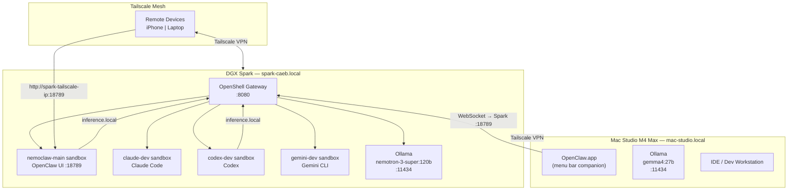

# NemoClaw Home Lab Deployment

[](https://github.com/macayaven/nemoclaw/actions/workflows/ci.yml)
[](https://www.python.org/downloads/)
[](LICENSE)

A **test-driven deployment framework** for running [NemoClaw](https://www.nvidia.com/nemoclaw) — NVIDIA's open-source reference stack for safe, private AI agent execution — across a two-node home lab. It contains the architecture documentation, phase-by-phase action plan, and pytest tests spanning pre-flight validation plus deployment and orchestration phases. Tests define the expected state of each machine before and after every deployment step; passing all tests in a phase means that phase is complete.

The stack runs four AI coding agents (OpenClaw, Claude Code, Codex, Gemini CLI) simultaneously in isolated OpenShell sandboxes, with local Nemotron inference as the default and cloud APIs as an explicit opt-in.

This repository does **not** contain a model-training subsystem or a runnable ML training loop. See [TRAINING-LOOP-BLOCKER.md](TRAINING-LOOP-BLOCKER.md).

---

## Architecture

### NemoClaw Three-Layer Architecture

Every agent request passes through three layers: the sandbox where the agent runs, the guardrail layer that enforces access and privacy policy, and the private inference router that defaults all inference to local hardware.


### Hardware Deployment



---

## Quick Start

### Prerequisites

- [uv](https://docs.astral.sh/uv/) — Python project manager
- Python 3.12 or later
- SSH access to DGX Spark (`spark-caeb.local`)
- Ollama running with `nemotron-3-super:120b` pulled on the Spark

### Install

```bash
git clone https://github.com/macayaven/nemoclaw.git
cd nemoclaw/tests
uv sync
```

### Configure

```bash
cp .env.example .env
# Edit .env and fill in machine IPs, SSH credentials, and API keys
```

Key variables:

| Variable | Description |
|---|---|
| `SPARK_HOST` | DGX Spark hostname or IP (e.g. `spark-caeb.local`) |
| `MAC_HOST` | Mac Studio hostname or IP (e.g. `mac-studio.local`) |
| `SSH_USER` | SSH username for remote machines |
| `ANTHROPIC_API_KEY` | Required for Claude Code sandbox |
| `OPENAI_API_KEY` | Required for Codex sandbox |
| `GEMINI_API_KEY` | Required for Gemini CLI sandbox |

### Run Phase 0 (pre-flight checks)

```bash
uv run pytest tests/phase0_preflight/ -v
```

All tests must pass before proceeding. Phase 0 validates disk space, Docker, NVIDIA container runtime, Ollama, kernel features (Landlock, seccomp, cgroup v2), Tailscale connectivity, and Node.js.

### Full Deployment

Follow the step-by-step guide in [docs/deployment-guide.md](docs/deployment-guide.md) after Phase 0 passes.

---

## Operations Quick Reference

### Start NemoClaw

```bash
# On Spark:
sudo systemctl start ollama
openshell gateway start                          # Wait ~2 min for k3s
# Sandboxes with --keep auto-start with gateway
```

### Stop NemoClaw

```bash
openshell gateway stop                           # Stops all sandboxes
sudo systemctl stop ollama                       # Optional: free GPU memory
```

### Recreate from Scratch

```bash
openshell gateway destroy                        # WARNING: deletes all sandboxes + providers
openshell gateway start
# Re-run Phase 1 from docs/deployment-guide.md
```

### Delete a Sandbox

```bash
openshell sandbox delete <name>                  # e.g. codex-dev
```

### Change Inference Provider

```bash
# Heavy model (Nemotron 120B on Spark) — default
openshell inference set --provider local-ollama --model nemotron-3-super:120b

# Fast model (Gemma 4 27B on Mac Studio)
openshell inference set --provider mac-ollama --model gemma4:27b

# NVIDIA Cloud (via API Catalog)
openshell inference set --provider nvidia-nim --model nvidia/nemotron-3-super-120b-a12b
```

### Check System Health

```bash
./scripts/status.sh                              # Full status in one command
openshell status                                 # Gateway health
openshell sandbox list                           # All sandboxes
openshell inference get                          # Active inference route
openshell term                                   # Real-time TUI monitor
```

Full operations guide: [docs/operations-guide.md](docs/operations-guide.md)

---

## Agents Supported

| Agent | Sandbox Name | Inference Path | Default Model | Cloud/Local |
|---|---|---|---|---|
| **OpenClaw** | `nemoclaw-main` | `inference.local` → OpenShell Gateway → Ollama | `nemotron-3-super:120b` | **Local** |
| **Claude Code** | `claude-dev` | Anthropic API (cloud) | `claude-sonnet-4-6` | Cloud |
| **Codex** | `codex-dev` | Ollama direct via `host.openshell.internal:11434` | `nemotron-3-super:120b` | **Local** |
| **Gemini CLI** | `gemini-dev` | Google Gemini API (cloud) | `gemini-3-flash` | Cloud |

OpenClaw and Codex run on **local inference** — prompts and responses never leave the home lab. Claude Code and Gemini CLI use cloud APIs; the sandbox guardrails make this boundary explicit and auditable.

---

## Project Structure

```
nemoclaw/
├── README.md                        # This file
├── nemoclaw-architecture.md         # Three-layer architecture deep dive
├── nemoclaw-tdd-plan.md             # TDD methodology and test design
├── orchestrator/                    # Inter-agent orchestration module
│
├── docs/
│   ├── deployment-guide.md          # Step-by-step deployment walkthrough
│   ├── operations-guide.md          # Start, stop, update, monitor
│   ├── use-cases.md                 # 10 step-by-step use case guides
│   ├── inter-agent-guide.md         # Inter-agent communication patterns
│   ├── cookbook.md                   # Recipes and common patterns
│   ├── runbook.md                   # Operational runbook
│   ├── benchmarks.md                # Performance measurements
│   └── openclaw-concepts.md         # OpenClaw concepts reference
│
├── scripts/
│   ├── status.sh                    # Full system status in one command
│   ├── install-hooks.sh             # Git pre-push hook installer
│   └── pre-push.sh                  # Pre-push validation
│
└── tests/                           # pytest test suite
    ├── phase0_preflight/            # Pre-flight checks on all machines
    ├── phase1_core/                 # NemoClaw on DGX Spark
    ├── phase2_mac/                  # Mac Studio integration
    ├── phase3_pi/                   # (Legacy — Pi no longer in topology)
    ├── phase4_agents/               # Coding agent sandboxes
    ├── phase5_mobile/               # Tailscale + mobile access
    └── phase6_orchestrator/         # Orchestrator unit/offline tests
```

---

## Test Phases

| Phase | Directory | Tests | What It Validates |
|---|---|---|---|
| **Phase 0** | `phase0_preflight/` | 28 | Disk space, Docker, NVIDIA runtime, Ollama, models, Landlock/seccomp/cgroup v2, Node.js, Tailscale |
| **Phase 1** | `phase1_core/` | 25 | Ollama on `0.0.0.0:11434`, OpenShell gateway, provider registration, inference routing, nemoclaw-main sandbox, idempotency |
| **Phase 2** | `phase2_mac/` | 17 | Ollama on Mac serving Gemma 4, mac-ollama provider, provider switching |
| **Phase 3** | `phase3_pi/` | 20 | *(Legacy — skipped when Pi is not in topology)* |
| **Phase 4** | `phase4_agents/` | 25 | Claude Code, Codex, Gemini CLI sandboxes, concurrency, isolation, secret hygiene |
| **Phase 5** | `phase5_mobile/` | 4 | Tailscale gateway binding, remote device reachability |
| **Phase 6** | `phase6_orchestrator/` | 47 | Orchestrator CLI, pipelines, sandbox bridge, shared workspace, task persistence |

```bash
# Run tests for a specific phase
uv run pytest tests/phase1_core/ -v

# By marker
uv run pytest -m contract -v        # fast, no network required
uv run pytest -m behavioral -v      # hits real endpoints
uv run pytest -m "not slow" -v      # skip cold-start tests

# Full suite
uv run pytest -v
```

---

## Documentation

| Document | Description |
|---|---|
| [docs/deployment-guide.md](docs/deployment-guide.md) | Step-by-step deployment walkthrough for all phases |
| [docs/operations-guide.md](docs/operations-guide.md) | Start, stop, pause, restart, update, and monitor NemoClaw |
| [docs/use-cases.md](docs/use-cases.md) | 10 step-by-step use case guides |
| [docs/inter-agent-guide.md](docs/inter-agent-guide.md) | Inter-agent communication and orchestration patterns |
| [docs/cookbook.md](docs/cookbook.md) | Recipes and common patterns |
| [docs/runbook.md](docs/runbook.md) | Operational runbook and troubleshooting |
| [nemoclaw-architecture.md](nemoclaw-architecture.md) | Three-layer architecture deep dive |
| [nemoclaw-tdd-plan.md](nemoclaw-tdd-plan.md) | TDD methodology and two-layer test design |

---

## Development

### Linting and Type Checking

```bash
uv run ruff check .
uv run ruff format --check .
uv run mypy tests/
```

### Pre-push Hook

```bash
./scripts/install-hooks.sh
```

---

## License

This project is licensed under the [Apache License 2.0](LICENSE).

---

## Acknowledgments

- [NVIDIA NemoClaw](https://www.nvidia.com/nemoclaw) — the open-source reference stack this deployment framework targets
- [OpenShell](https://openShell.ai) — the secure sandbox runtime powering agent isolation
- [OpenClaw](https://openClaw.ai) — the AI agent application running inside NemoClaw sandboxes
