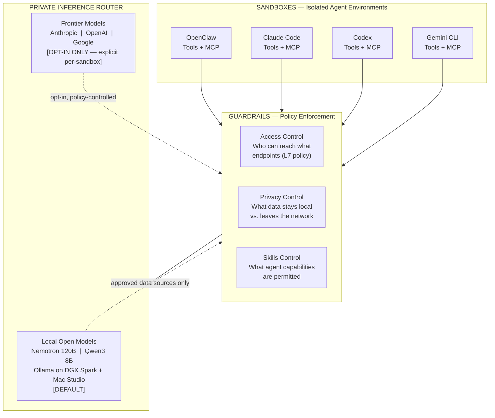
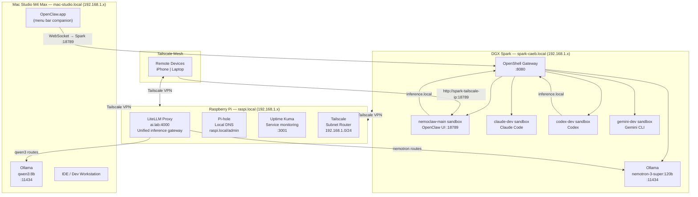
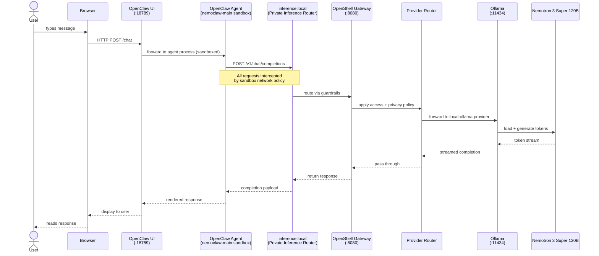

# NemoClaw Home Lab Deployment

[](https://github.com/macayaven/nemoclaw/actions/workflows/ci.yml)
[](https://www.python.org/downloads/)
[](LICENSE)

This repository is a **test-driven deployment framework** for running [NemoClaw](https://www.nvidia.com/nemoclaw) — NVIDIA's open-source reference stack for safe, private AI agent execution — across a three-node home lab. It contains the architecture documentation, phase-by-phase action plan, and 166 pytest tests spanning pre-flight validation plus deployment and orchestration phases. Tests define the expected state of each machine before and after every deployment step; passing all tests in a phase means that phase is complete. The stack runs four AI coding agents (OpenClaw, Claude Code, Codex, Gemini CLI) simultaneously in isolated OpenShell sandboxes, with local Nemotron inference as the default and cloud APIs as an explicit opt-in.

This repository does **not** contain a model-training subsystem or a runnable ML training loop. If you are looking for training-entrypoint, dataloader, optimizer, checkpoint, or resume logic, see [TRAINING-LOOP-BLOCKER.md](TRAINING-LOOP-BLOCKER.md).

---

## Architecture

### NemoClaw Three-Layer Architecture

Every agent request passes through all three layers in sequence: the sandbox where the agent runs, the guardrail layer that enforces access and privacy policy, and the private inference router that defaults all inference to local hardware.



### Hardware Deployment



### Request Flow



---

## Quick Start

### Prerequisites

- [uv](https://docs.astral.sh/uv/) — Python project manager
- Python 3.12 or later
- SSH access to DGX Spark (`spark-caeb.local`) and Raspberry Pi (`raspi.local`)
- Ollama running with `nemotron-3-super:120b` pulled on the Spark

### Install

```bash
git clone https://github.com/macayaven/nemoclaw.git
cd nemoclaw/tests
uv sync
```

### Configure

```bash
cp .env.example .env
# Edit .env and fill in machine IPs, SSH credentials, and API keys
```

Key variables:

| Variable | Description |
|---|---|
| `SPARK_HOST` | DGX Spark hostname or IP (e.g. `spark-caeb.local`) |
| `MAC_HOST` | Mac Studio hostname or IP (e.g. `mac-studio.local`) |
| `PI_HOST` | Raspberry Pi hostname or IP (e.g. `raspi.local`) |
| `SSH_USER` | SSH username for remote machines |
| `ANTHROPIC_API_KEY` | Required for Claude Code sandbox (Phase 4) |
| `OPENAI_API_KEY` | Required for Codex sandbox (Phase 4) |
| `GEMINI_API_KEY` | Required for Gemini CLI sandbox (Phase 4) |

### Run Phase 0 (pre-flight checks)

```bash
uv run pytest tests/phase0_preflight/ -v
```

All 26 tests must pass before proceeding with deployment. Phase 0 validates disk space, Docker, NVIDIA container runtime, Ollama, kernel features (Landlock, seccomp, cgroup v2), Tailscale connectivity, and Node.js on all three machines.

### Full Deployment

Follow the step-by-step guide in [docs/deployment-guide.md](docs/deployment-guide.md) after Phase 0 passes. Each phase has a corresponding test suite; run it after completing the phase's deployment steps to confirm success.

```bash
# Run tests for a specific phase
uv run pytest tests/phase1_core/ -v
uv run pytest tests/phase2_mac/ -v
uv run pytest tests/phase3_pi/ -v
uv run pytest tests/phase4_agents/ -v
uv run pytest tests/phase5_mobile/ -v
uv run pytest tests/phase6_orchestrator/ -v

# Run the full suite
uv run pytest -v
```

---

## Project Structure

```
nemoclaw/
├── README.md                        # This file
├── nemoclaw-architecture.md         # Conceptual guide — three-layer architecture explained
├── nemoclaw-action-plan.md          # Step-by-step deployment instructions for all phases
├── nemoclaw-tdd-plan.md             # TDD methodology, tooling decisions, and test design
├── nemoclaw-technical-spec.docx     # Original NVIDIA NemoClaw technical specification
├── openshell-env/                   # OpenShell Python virtualenv (used on DGX Spark)
│
├── docs/
│   └── deployment-guide.md          # Consolidated deployment walkthrough
│
└── tests/                           # pytest test suite (166 tests across pre-flight + 6 phases)
    ├── pyproject.toml               # uv project config and pytest markers
    ├── conftest.py                  # Shared fixtures, SSH wrapper, host configs
    ├── settings.py                  # Pydantic BaseSettings — validated env config
    ├── models.py                    # Pydantic models for command output validation
    ├── helpers.py                   # poll_until_ready(), parse_json_output(), etc.
    │
    ├── phase0_preflight/            # 28 tests — prerequisite checks on all 3 machines
    │   ├── test_spark_prerequisites.py
    │   ├── test_mac_prerequisites.py
    │   └── test_pi_prerequisites.py
    │
    ├── phase1_core/                 # 25 tests — NemoClaw on DGX Spark
    │   ├── test_ollama_config.py
    │   ├── test_gateway.py
    │   ├── test_provider.py
    │   ├── test_inference_routing.py
    │   ├── test_sandbox_openclaw.py
    │   └── test_idempotency.py
    │
    ├── phase2_mac/                  # 17 tests — Mac Studio integration
    │   ├── test_mac_ollama.py
    │   ├── test_mac_provider.py
    │   └── test_provider_switching.py
    │
    ├── phase3_pi/                   # 20 tests — Raspberry Pi infrastructure plane
    │   ├── test_litellm_proxy.py
    │   ├── test_litellm_degraded.py
    │   ├── test_dns.py
    │   ├── test_monitoring.py
    │   └── test_tailscale_routing.py
    │
    ├── phase4_agents/               # 25 tests — Coding agent sandboxes
    │   ├── test_claude_sandbox.py
    │   ├── test_codex_sandbox.py
    │   ├── test_gemini_sandbox.py
    │   ├── test_multi_sandbox.py
    │   ├── test_sandbox_isolation.py
    │   └── test_secret_hygiene.py
    │
    ├── phase5_mobile/               # 4 tests — Tailscale hardening + mobile access
    │   ├── test_tailscale_gateway.py
    │   └── test_remote_access.py
    │
    └── phase6_orchestrator/         # 47 tests — Orchestrator CLI/runtime/unit validation
        ├── test_cli.py
        ├── test_orchestrator.py
        ├── test_sandbox_bridge.py
        ├── test_shared_workspace.py
        └── test_task_manager.py
```

---

## Test Phases

| Phase | Directory | Tests | What It Validates |
|---|---|---|---|
| **Phase 0 — Pre-flight** | `phase0_preflight/` | 28 | Disk space, Docker 28.04+, NVIDIA container runtime, Ollama + models, Landlock/seccomp/cgroup v2, Node.js 20+, Tailscale connectivity on all 3 machines |
| **Phase 1 — Core** | `phase1_core/` | 25 | Ollama binding on `0.0.0.0:11434`, OpenShell gateway health, provider registration, inference routing to nemotron-3-super:120b, nemoclaw-main sandbox lifecycle, idempotency of all setup steps |
| **Phase 2 — Mac Studio** | `phase2_mac/` | 17 | Ollama on Mac serving qwen3:8b, mac-ollama provider registration on Spark gateway, provider switching between Spark and Mac inference endpoints |
| **Phase 3 — Pi Infra** | `phase3_pi/` | 20 | LiteLLM proxy routing to both machines, degraded-mode fallback behaviour, Pi-hole DNS resolution (`spark.lab`, `mac.lab`, `ai.lab`), Uptime Kuma monitors, Tailscale subnet router |
| **Phase 4 — Agents** | `phase4_agents/` | 25 | Claude Code sandbox with Anthropic provider, Codex sandbox with local Ollama config, Gemini CLI sandbox with custom network policy, multi-sandbox concurrency, inter-sandbox isolation, secret hygiene (no keys in env of wrong sandbox) |
| **Phase 5 — Mobile** | `phase5_mobile/` | 4 | Tailscale-native gateway binding, remote device reachability via Tailscale IP |
| **Phase 6 — Orchestrator** | `phase6_orchestrator/` | 47 | Orchestrator CLI behavior, pipeline delegation, sandbox bridge execution, shared workspace messaging, and task manager persistence via offline/unit validation |

Each test file contains two layers: **contract tests** (`@pytest.mark.contract`) that validate config schemas and command output structure without touching real infrastructure, and **behavioral tests** (`@pytest.mark.behavioral`) that hit live endpoints and verify end-to-end flows.

---

## Agents Supported

| Agent | Sandbox Name | Inference Path | Default Model | Policy Source |
|---|---|---|---|---|
| **OpenClaw** | `nemoclaw-main` | `inference.local` → OpenShell Gateway → Ollama | `nemotron-3-super:120b` (local) | Built-in NemoClaw policy |
| **Claude Code** | `claude-dev` | Anthropic API (cloud) | `claude-sonnet-4-6` | Built-in OpenShell policy (fully supported) |
| **Codex** | `codex-dev` | Ollama direct via `host.openshell.internal:11434` | `nemotron-3-super:120b` (local) | Custom network policy required |
| **Gemini CLI** | `gemini-dev` | Google Gemini API (cloud) | `gemini-3-flash` | Custom network policy required |

OpenClaw and Codex run on **local inference** — prompts and responses never leave the home lab. Claude Code and Gemini CLI use cloud APIs; the sandbox guardrails make this boundary explicit and auditable via `openshell term`.

---

## Documentation

| Document | Description |
|---|---|
| [docs/deployment-guide.md](docs/deployment-guide.md) | Full step-by-step deployment walkthrough for the deployment phases |
| [docs/operations-guide.md](docs/operations-guide.md) | Start, stop, pause, restart, update, and monitor NemoClaw |
| [docs/use-cases.md](docs/use-cases.md) | 10 step-by-step use case guides (chat, model switching, sandboxed agents, mobile access, API) |
| [docs/inter-agent-guide.md](docs/inter-agent-guide.md) | Inter-agent communication, cooperation, and orchestration patterns (Shared MCP, Orchestrator, Shared FS) |
| [nemoclaw-architecture.md](nemoclaw-architecture.md) | Three-layer architecture deep dive, sandbox internals, guardrail design |
| [nemoclaw-action-plan.md](nemoclaw-action-plan.md) | Timed action plan with commands, verification steps, and a complete execution checklist |
| [nemoclaw-tdd-plan.md](nemoclaw-tdd-plan.md) | TDD methodology, two-layer test design (contract vs. behavioral), tooling rationale |

---

## Development

### Running Tests

```bash
# All tests
uv run pytest -v

# Single phase
uv run pytest tests/phase0_preflight/ -v

# By marker
uv run pytest -m contract -v        # fast, no network required
uv run pytest -m behavioral -v      # hits real endpoints
uv run pytest -m "not slow" -v      # skip cold-start / model-load tests

# Parallel execution (Phase 0 across machines)
uv run pytest tests/phase0_preflight/ -n auto -v
```

### Linting and Type Checking

```bash
uv run ruff check .
uv run ruff format --check .
uv run mypy tests/
```

### Pre-push Hook

```bash
./scripts/pre-push.sh
```

The pre-push hook runs contract tests (`-m contract`) and linting before allowing a push. Behavioral tests are left for CI to avoid requiring live infrastructure on the dev machine.

---

## Next Steps

- [ ] Execute Phase 1 deployment on DGX Spark
- [ ] Configure OpenClaw.app on Mac Studio
- [ ] Set up LiteLLM + Pi-hole on Raspberry Pi
- [ ] Create custom sandbox Dockerfile for Gemini CLI
- [ ] Add vLLM/TensorRT-LLM as alternative to Ollama on Spark
- [ ] Implement MCP server sharing across all four agent sandboxes
- [ ] Add Grafana dashboard for GPU utilization and inference latency metrics
- [ ] Automate full deployment with an Ansible playbook

---

## License

This project is licensed under the [Apache License 2.0](LICENSE).

---

## Acknowledgments

- [NVIDIA NemoClaw](https://www.nvidia.com/nemoclaw) — the open-source reference stack this deployment framework targets
- [OpenShell](https://openShell.ai) — the secure sandbox runtime powering agent isolation
- [OpenClaw](https://openClaw.ai) — the AI agent application running inside NemoClaw sandboxes
