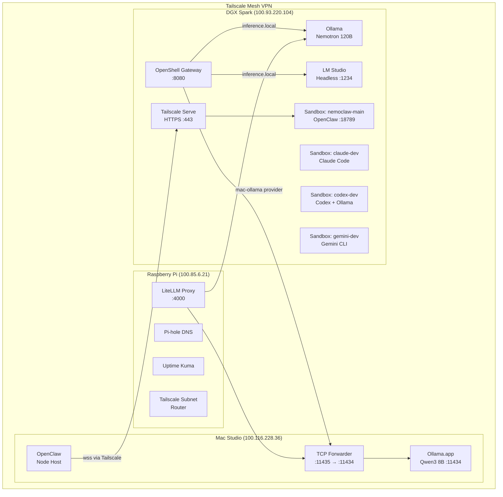
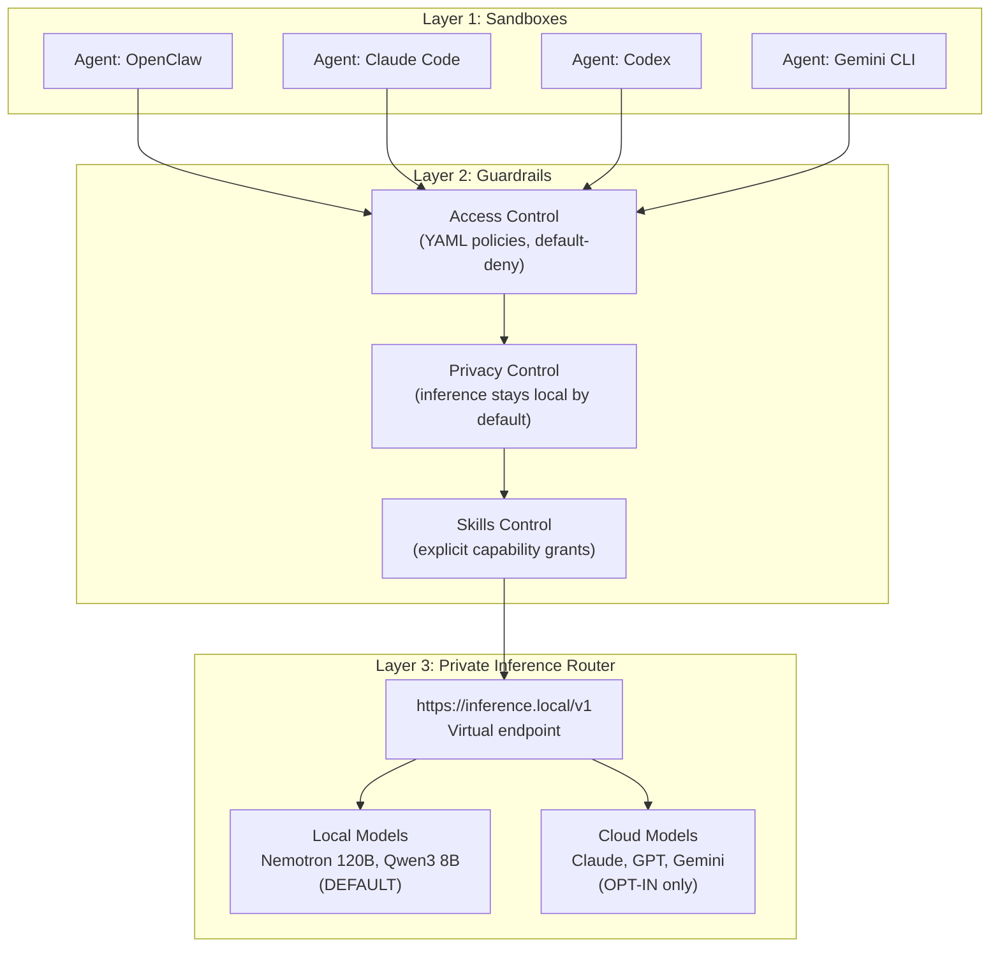

# Running a 120B Parameter Model Locally with Multi-Machine AI Agents: A Complete NemoClaw Deployment Guide

**How I deployed NVIDIA's NemoClaw across a DGX Spark, Mac Studio, and Raspberry Pi — with 4 isolated coding agents, private inference, and zero cloud dependency**

*Published March 2026 | Part 1 of a series | AI-assisted deployment, human-written article*

---

## TL;DR

- NemoClaw is NVIDIA's open-source reference stack for running AI agents safely on your own hardware — it wraps agents in isolated sandboxes with a private inference router
- We deployed a 120B parameter Nemotron model on a DGX Spark (128GB Blackwell GPU) with four fully isolated coding agents: OpenClaw, Claude Code, Codex, and Gemini CLI
- A Mac Studio (M4 Max, 36GB) acts as a fast secondary inference server for lighter workloads, connected via a TCP forwarder that works around Cursor IDE's port conflict
- A Raspberry Pi runs the infrastructure layer: unified API gateway (LiteLLM), DNS (Pi-hole), monitoring (Uptime Kuma), and Tailscale subnet routing — all at 5W
- Total deployment time was approximately two hours including troubleshooting; this guide documents every step, every gotcha, and every fix

---

## Why This Matters

Running AI coding agents directly on your machine is convenient until it isn't. The moment you type `claude` or `codex` in a terminal, that agent inherits your full filesystem permissions, your network access, and your credentials. It can read your SSH keys. It can exfiltrate source code. It can make network requests you never authorized. And you have no audit trail of what it actually did.

The standard response is to use hosted cloud agents, which trades one problem for another. Now your proprietary code leaves your machine on every request. You pay per token at scale. You depend on uptime you don't control. And you still have no meaningful audit trail — just the provider's promise that they're not training on your data.

NemoClaw offers a third option: agents that run on your hardware, inside cryptographically isolated sandboxes, with inference routed through a private proxy that defaults to local models. Cloud is opt-in, not the default. This guide documents exactly how to build it.

This is also an honest account of a real deployment, not a polished demo. The mistakes are included. The workarounds are included. If you follow this, you should end up with a working system.

---

## What We're Building

The finished system consists of three machines connected via Tailscale, each with a distinct role:

- **DGX Spark** (NVIDIA GB10 Blackwell, 128GB UMA, Ubuntu 24.04 ARM64) — primary inference host for the 120B Nemotron model, control plane for four agent sandboxes, and Tailscale HTTPS endpoint
- **Mac Studio** (M4 Max, 36GB, macOS 15.4) — secondary inference host running Qwen3 8B for fast responses, primary development workstation, and OpenClaw companion app host
- **Raspberry Pi** (ARM64, 3.7GB RAM, Debian Bookworm) — infrastructure control plane running LiteLLM proxy, Pi-hole DNS, Uptime Kuma monitoring, and Tailscale subnet routing



*Figure 1: Full three-machine NemoClaw architecture connected via Tailscale mesh VPN.*

---

## The NemoClaw Stack (Conceptual)

Before touching a command, it helps to understand what NemoClaw actually is. The name refers to a layered stack, not a single application.

### The Four Layers

```
Ollama (engine)
  Loads and serves LLMs. Provides an OpenAI-compatible REST API.
  └── OpenShell (platform)
        Manages sandboxes, credentials, inference routing, and policies.
        Uses k3s internally — you never interact with k3s directly.
        └── OpenClaw (application)
              The AI agent. Runs inside an OpenShell sandbox.
              Browser UI on port 18789, TUI mode, CLI mode.
              └── NemoClaw (deployment)
                    Your specific configuration: Nemotron on DGX Spark,
                    four sandboxes, multi-machine routing, Tailscale.
```

NemoClaw is not a Kubernetes deployment you manage. It is not just OpenClaw with a local model. It is the combination of all four layers, wired together with declarative configuration and a CLI that handles the orchestration.

### The Three-Layer Security Model

Every request from every agent passes through three enforcement layers:



*Figure 2: Three-layer security model. Every agent call is filtered by sandboxing, guardrails, and the inference router before reaching a model.*

**Layer 1 — Sandboxes** provide kernel-level isolation: Landlock LSM for filesystem restriction, seccomp for syscall filtering, and network namespaces per container. Agents can only write to `/sandbox` and `/tmp`. All outbound network connections are blocked by default.

**Layer 2 — Guardrails** are declarative YAML policies defining exactly which network endpoints each agent can reach, and with which HTTP methods. An agent can be allowed to GET from a repository host but blocked from POST. Unknown destinations trigger an operator approval prompt in the monitoring TUI.

**Layer 3 — Private Inference Router** is the `inference.local` virtual endpoint. All four agents call `https://inference.local/v1` — they never see the actual Ollama address or credentials. The OpenShell gateway intercepts each request, injects credentials, and forwards to the configured provider. You can switch models in five seconds without restarting any sandbox.

---

## Hardware Requirements

Here is what we used. None of this is required — the "minimum viable setup" section below describes how to adapt this to a single machine.

| Machine | CPU/GPU | RAM | OS | Tailscale IP | Role |
|---------|---------|-----|----|--------------|------|
| DGX Spark | NVIDIA GB10 Blackwell | 128GB UMA | Ubuntu 24.04 ARM64 | 100.93.220.104 | Primary inference + control plane |
| Mac Studio | Apple M4 Max | 36GB | macOS 15.4 | 100.116.228.36 | Secondary inference + dev workstation |
| Raspberry Pi | ARM64 Cortex-A72 | 3.7GB | Debian Bookworm | 100.85.6.21 | Infrastructure layer |

### Minimum Viable Setup

You do not need three machines to run NemoClaw. The minimum requirements are:

- **One machine with a GPU and Docker** — any Linux machine with 16GB+ VRAM can run a useful model (e.g., Qwen3 8B at Q4 quantization requires about 8GB VRAM)
- **Ollama installed and a model downloaded** — `ollama pull qwen3:8b` is a good starting point
- **OpenShell installed** — `pip install openshell` in a virtualenv
- **NemoClaw CLI installed** — `npm install -g nemoclaw`

The three-machine setup in this guide adds secondary inference, infrastructure monitoring, and subnet routing. All of that is additive. Start with one machine and expand.

---

## Phase 1: Core Deployment on DGX Spark

This is the foundational phase. Every other phase builds on what we configure here.

### Step 1: Configure Ollama

Ollama by default binds to `127.0.0.1:11434`, which means it is unreachable from inside Docker containers — including the OpenShell sandboxes that need to call it. We fix this with a systemd override that also sets `KEEP_ALIVE=-1` to prevent the model from being evicted from VRAM between requests.

```bash
sudo tee /etc/systemd/system/ollama.service.d/override.conf << 'EOF'
[Service]
Environment="OLLAMA_HOST=0.0.0.0"
Environment="OLLAMA_KEEP_ALIVE=-1"
EOF
sudo systemctl daemon-reload
sudo systemctl restart ollama
```

Verify it worked:

```bash
ss -tlnp | grep 11434
# Expected: *:11434 (not 127.0.0.1:11434)
```

Without `KEEP_ALIVE=-1`, a 120B model takes 30-60 seconds to load back into VRAM after an idle timeout. In practice this makes the system feel broken.

### Step 2: Start LM Studio Headless

LM Studio provides an Anthropic-compatible API endpoint alongside Ollama's OpenAI-compatible one. This gives you a second inference path without adding another tool.

```bash
lms server start --port 1234 --bind 0.0.0.0 --cors
```

LM Studio's background daemon (`llmster`) may already be running. If `lms server start` reports a verification failure, check with `ss -tlnp | grep 1234` — if the port is bound, the daemon is active and you can continue.

### Step 3: Start the OpenShell Gateway

The gateway is the control plane. It runs k3s inside Docker and manages sandbox lifecycle, credential injection, inference routing, and policy enforcement.

```bash
source ~/workspace/nemoclaw/openshell-env/bin/activate
openshell gateway start --recreate
```

The `--recreate` flag is important if a previous gateway exists but is not running. Without it, the command fails silently. The gateway takes approximately 15 seconds to bootstrap.

Verify with `openshell status` — you should see `Status: Connected`.

### Step 4: Register Inference Providers

Providers are named credential bundles that tell OpenShell where to send inference requests. The key hostname here is `host.openshell.internal` — this is a special DNS name that resolves to the gateway host from inside any sandbox. You cannot use `localhost` or `127.0.0.1` from inside a container.

```bash
# Ollama provider (primary — Nemotron 120B)
openshell provider create \
    --name local-ollama \
    --type openai \
    --credential OPENAI_API_KEY=not-needed \
    --config OPENAI_BASE_URL=http://host.openshell.internal:11434/v1

# LM Studio provider (Anthropic-compatible alternative)
openshell provider create \
    --name local-lmstudio \
    --type openai \
    --credential OPENAI_API_KEY=lm-studio \
    --config OPENAI_BASE_URL=http://host.openshell.internal:1234/v1
```

### Step 5: Set the Default Inference Route

This command tells all sandboxes which model to use when they call `https://inference.local/v1`.

```bash
openshell inference set --provider local-ollama --model nemotron-3-super:120b
```

Verify with `openshell inference get`. The gateway validates the endpoint is reachable before confirming.

### Step 6: Create the OpenClaw Sandbox

```bash
openshell sandbox create \
    --keep \
    --forward 18789 \
    --name nemoclaw-main \
    --from openclaw \
    -- openclaw-start
```

The `--keep` flag persists the sandbox across gateway restarts. The `--from openclaw` flag pulls the community OpenClaw image, which includes pre-configured network policies. Without `--forward 18789`, the OpenClaw browser UI is not accessible from the host.

### Step 7: Run OpenClaw Onboarding

The `openclaw-start` script launches an interactive onboarding wizard. It defaulted to "No" on the security acknowledgment in our deployment, so we had to run it manually.

```bash
openshell sandbox connect nemoclaw-main
# Now inside the sandbox:
openclaw onboard
```

The wizard walks through eight prompts. The critical answers:

| Prompt | Answer |
|--------|--------|
| Security acknowledgment | Yes |
| Onboarding mode | QuickStart |
| Model/auth provider | Custom Provider |
| API Base URL | `https://inference.local/v1` |
| API Key | `ollama` |
| Endpoint compatibility | OpenAI-compatible |
| Model ID | `nemotron-3-super:120b` |
| Channel / Skills / Hooks | Skip for now |

**The most common mistake here:** entering `https://inference.local:11434/v1` instead of `https://inference.local/v1`. The `inference.local` hostname is a virtual endpoint managed by OpenShell's proxy — it has no port. Adding `:11434` produces a 403 error that is not obviously explained by the response.

### Step 8: Start the Gateway and Verify

```bash
# Inside the sandbox:
nohup openclaw gateway run > /tmp/gateway.log 2>&1 &

# Verify end-to-end inference:
curl -s https://inference.local/v1/chat/completions \
    -H 'Content-Type: application/json' \
    -d '{"model":"nemotron-3-super:120b","messages":[{"role":"user","content":"Say hello"}],"max_tokens":10}'
```

A successful response confirms the full chain: sandbox to `inference.local`, to the OpenShell gateway, to Ollama, to Nemotron 120B, and back. Access the browser UI at `http://127.0.0.1:18789/`.

---

## Phase 2: Adding a Second Machine (Mac Studio)

The Mac Studio provides a fast secondary inference path. Qwen3 8B on M4 Max responds in under a second for most prompts, which makes it useful for quick tasks while the Spark handles heavy multi-step reasoning with Nemotron.

### The Cursor Port Conflict

The Mac Studio's Ollama is managed by the Ollama.app GUI, which also provides models to Cursor IDE. Both the GUI and Cursor share `127.0.0.1:11434`. Changing the binding address in Ollama.app breaks Cursor. We cannot change the binding.

The solution is a minimal TCP forwarder written in the Python standard library — no dependencies, no installation. It listens on port 11435 (network-accessible) and proxies to port 11434 (localhost).

```python
# Run on the Mac Studio (via SSH from the Spark)
python3 -c "
import socket, threading

def forward(src, dst):
    try:
        while True:
            data = src.recv(65536)
            if not data: break
            dst.sendall(data)
    except: pass
    src.close(); dst.close()

server = socket.socket(socket.AF_INET, socket.SOCK_STREAM)
server.setsockopt(socket.SOL_SOCKET, socket.SO_REUSEADDR, 1)
server.bind(('0.0.0.0', 11435))
server.listen(50)
while True:
    client, _ = server.accept()
    upstream = socket.socket(socket.AF_INET, socket.SOCK_STREAM)
    upstream.connect(('127.0.0.1', 11434))
    threading.Thread(target=forward, args=(client, upstream), daemon=True).start()
    threading.Thread(target=forward, args=(upstream, client), daemon=True).start()
" &
```

This is intentionally minimal. A production setup would wrap this in a launchd service. For now, it works as a background process.

### Register the Mac as an Inference Provider

Back on the Spark:

```bash
openshell provider create \
    --name mac-ollama \
    --type openai \
    --credential OPENAI_API_KEY=not-needed \
    --config OPENAI_BASE_URL=http://100.116.228.36:11435/v1
```

Switching between the 120B and 8B models now takes about five seconds and requires no sandbox restart:

```bash
# Switch to Mac (fast, 8B)
openshell inference set --provider mac-ollama --model qwen3:8b

# Switch back to Spark (heavy, 120B)
openshell inference set --provider local-ollama --model nemotron-3-super:120b
```

### Installing the OpenClaw Companion App

The OpenClaw "node host" is a headless service running on the Mac that gives the NemoClaw agent access to Mac-native capabilities: screen recording, camera, AppleScript automation, and system notifications. It connects back to the Spark's OpenClaw gateway over Tailscale.

First, extract the gateway authentication token from the sandbox:

```bash
# On the Spark:
ssh -o StrictHostKeyChecking=no \
    -o "ProxyCommand=openshell ssh-proxy --gateway-name openshell --name nemoclaw-main" \
    sandbox@openshell-nemoclaw-main \
    "python3 -c \"import json; gw=json.load(open('/sandbox/.openclaw/openclaw.json')).get('gateway',{}); print(gw.get('auth',{}).get('token','NOT FOUND'))\""
```

Then install the node host on the Mac as a launchd service:

```bash
# On the Mac:
openclaw node install \
    --host spark-caeb.tail48bab7.ts.net \
    --port 443 \
    --tls \
    --force \
    --display-name "Mac Studio"
```

The connection chain from Mac to Spark runs through four hops:

```
Mac node host
  → wss://spark-caeb.tail48bab7.ts.net:443  (Tailscale Serve HTTPS proxy)
    → 127.0.0.1:18789                         (OpenShell port forward on Spark)
      → sandbox nemoclaw-main:18789            (OpenClaw gateway in sandbox)
```

The most fragile link is the OpenShell port forward — it is an SSH tunnel that can drop silently. If the node host reports a 502 error, restart the forward on the Spark:

```bash
openshell forward start 18789 nemoclaw-main --background
```

---

## Phase 3: Infrastructure Layer on Raspberry Pi

The Pi might seem like an odd addition. It has 3.7GB of RAM and cannot run any meaningful model. Its value is as a low-power, always-on infrastructure host — a control plane that runs independently of the machines doing heavy work.

### LiteLLM Proxy

LiteLLM turns into a unified API gateway for all machines on the network. Any client hitting `http://pi:4000/v1/chat/completions` gets routed to the correct machine based on model name.

```bash
# On the Pi:
python3 -m venv ~/litellm-env
source ~/litellm-env/bin/activate
pip install "litellm[proxy]"
```

```yaml
# ~/litellm/config.yaml
model_list:
  - model_name: "nemotron-3-super:120b"
    litellm_params:
      model: "ollama/nemotron-3-super:120b"
      api_base: "http://100.93.220.104:11434"
  - model_name: "qwen3:8b"
    litellm_params:
      model: "ollama/qwen3:8b"
      api_base: "http://100.116.228.36:11435"
```

```bash
sudo systemctl enable litellm && sudo systemctl start litellm
```

### Pi-hole and DNS

Pi-hole provides local DNS resolution for the lab. We added custom DNS records: `spark.lab`, `mac.lab`, and `ai.lab` — human-readable names that survive IP changes. This removes any hardcoded IPs from configuration files.

### Uptime Kuma

Uptime Kuma monitors all inference endpoints, the OpenShell gateway, and the Tailscale Serve HTTPS endpoint. When anything goes down, it sends an alert. This is how we know about silent port forward drops before the node host starts returning 502s.

### Tailscale Subnet Router

```bash
sudo tailscale up --advertise-routes=192.168.1.0/24 --accept-routes
```

With subnet routing enabled on the Pi, any Tailscale device can reach any machine on the local network `192.168.1.0/24` — without needing Tailscale installed on every device. This is how a phone or tablet can reach the Spark without a per-device setup.

---

## Phase 4: Four Agent Sandboxes

With the infrastructure running, we create four independent agent sandboxes. Each has its own filesystem, its own network policy, and its own inference path.

### Creating the Sandboxes

```bash
# Claude Code — uses Anthropic cloud API
openshell sandbox create --keep --name claude-dev --auto-providers -- claude

# Codex — configured for local Ollama inference
openshell sandbox create --keep --name codex-dev --auto-providers -- bash

# Gemini CLI — requires custom npm install inside the sandbox
openshell sandbox create --keep --name gemini-dev --auto-providers -- bash
```

### Configuring Codex for Local Inference

Codex has a quirk: it hardcodes its API calls to `localhost` by default and cannot be told to use `inference.local`. We configure it directly with an `~/.codex/config.toml` inside the sandbox.

```toml
# ~/.codex/config.toml (inside codex-dev sandbox)
model = "nemotron-3-super:120b"
model_provider = "ollama"

[model_providers.ollama]
name = "Ollama (Spark Local)"
base_url = "http://host.openshell.internal:11434/v1"
env_key = "OLLAMA_API_KEY"
wire_api = "responses"
```

This is the only agent that bypasses `inference.local` entirely and calls Ollama directly through the `host.openshell.internal` bridge. It still stays within the sandbox network policy.

### Installing Gemini CLI in the Sandbox

```bash
openshell sandbox connect gemini-dev
# Inside the sandbox:
mkdir -p ~/.npm-global
npm config set prefix ~/.npm-global
export PATH=~/.npm-global/bin:$PATH
npm install -g @google/gemini-cli
echo 'export PATH=~/.npm-global/bin:$PATH' >> ~/.bashrc
```

The sandbox runs as a non-root `sandbox` user. Global npm installs to `/usr/local` fail with permission errors. The `~/.npm-global` prefix sidesteps this without requiring sudo.

### The Privacy Boundary

The four sandboxes represent two distinct privacy models:

| Sandbox | Inference Path | Data Leaves Hardware? |
|---------|---------------|----------------------|
| nemoclaw-main | `inference.local` → Ollama → Nemotron 120B | No |
| codex-dev | `host.openshell.internal:11434` → Ollama → Nemotron 120B | No |
| claude-dev | Anthropic API | Yes (Anthropic) |
| gemini-dev | Google Gemini API | Yes (Google) |

The sandbox guardrails make this boundary explicit and enforced, not just documented. A sandbox configured for local inference cannot reach the Anthropic API even if the agent tries.

---

## Phase 5: Remote Access via Tailscale Serve

Tailscale Serve creates an HTTPS endpoint for the OpenClaw gateway, reachable from any Tailscale device with a valid TLS certificate — no self-signed certificates, no port forwarding through a router.

On the Spark:

```bash
tailscale serve --bg https / http://127.0.0.1:18789
```

This creates `https://spark-caeb.tail48bab7.ts.net` as a Tailscale-network-only HTTPS endpoint pointing to the OpenClaw UI. Access it from any device on your Tailscale network: phone, tablet, laptop.

The companion app on the Mac uses this same endpoint for its WebSocket connection to the gateway (the `wss://` in the connection chain described earlier). A single HTTPS endpoint serves both browser access and the companion app connection.

---

## What We Learned

### 1. `inference.local` Has No Port

Use `https://inference.local/v1`. Never `https://inference.local:11434`. The hostname is a virtual endpoint managed entirely by OpenShell's internal proxy — adding a port number routes to a different service that returns a 403.

### 2. Cursor Grabs Ollama's Port

On macOS, Cursor IDE runs an embedded Ollama instance on port 11434. You cannot reconfigure this without breaking Cursor. The TCP forwarder pattern works around this without touching either application.

### 3. Sandbox Users Have Limited Permissions

The `sandbox` user has no sudo access and cannot write to system paths. Use `~/.npm-global` for npm packages, `~/venv` for Python, and `~/bin` for binaries. Any install that requires root will fail inside a sandbox by design.

### 4. The Port Forward is the Most Fragile Link

The OpenShell port forward (`openshell forward start 18789 nemoclaw-main`) is an SSH tunnel. SSH tunnels drop silently under network changes, gateway restarts, or extended idle periods. The entire Mac companion app connection depends on this tunnel being live. Wrap it in a health check or systemd watchdog for production use.

### 5. Browser Auth, Not API Keys

Modern AI subscriptions (Claude Pro, Codex, Gemini Advanced) authenticate via browser OAuth, not API keys. The `--auto-providers` flag when creating sandboxes sets up the browser auth redirect. Authenticate inside each sandbox after creation.

### 6. `KEEP_ALIVE=-1` is Not Optional for 120B Models

Without it, Ollama evicts the model from VRAM after a few minutes of inactivity. The cold-start penalty for a 120B model at Q4 quantization is 30-60 seconds per request after eviction. The system becomes effectively unusable.

### 7. Tailscale Solves the Multi-Machine Networking Problem

Every machine on Tailscale gets a stable IP that doesn't change with DHCP renewals, network switches, or reboots. We used Tailscale IPs in every provider configuration. No private DNS, no hardcoded local IPs, no router port forwarding required.

### 8. The Pi Earns Its Place

A Raspberry Pi cannot run inference. What it can do is run LiteLLM, Pi-hole, Uptime Kuma, and a Tailscale subnet router at 5W continuous power draw. These services make the whole system more observable, more resilient, and easier to operate from any device on the network. That is worth the $80 hardware cost.

---

## Generic Multi-Device Guide

The three-machine setup is not a requirement. Here is how to adapt this to different hardware configurations.

### Single Machine (Minimum)

Requirements: Linux, Docker, 16GB+ VRAM, Ollama, OpenShell, NemoClaw CLI.

```bash
# 1. Configure Ollama
sudo tee /etc/systemd/system/ollama.service.d/override.conf << 'EOF'
[Service]
Environment="OLLAMA_HOST=0.0.0.0"
Environment="OLLAMA_KEEP_ALIVE=-1"
EOF
sudo systemctl daemon-reload && sudo systemctl restart ollama

# 2. Start OpenShell gateway
source ~/openshell-env/bin/activate
openshell gateway start

# 3. Register local Ollama
openshell provider create \
    --name local-ollama \
    --type openai \
    --credential OPENAI_API_KEY=not-needed \
    --config OPENAI_BASE_URL=http://host.openshell.internal:11434/v1

# 4. Set inference route
openshell inference set --provider local-ollama --model <your-model>

# 5. Create sandbox
openshell sandbox create --keep --forward 18789 --name main --from openclaw -- openclaw-start

# 6. Onboard inside sandbox
openshell sandbox connect main
openclaw onboard  # Use https://inference.local/v1 as the API base URL
```

### Adding a Second Machine

Requirements: Second machine with GPU and Ollama installed.

If the second machine's Ollama binds to `0.0.0.0`, register it directly:

```bash
openshell provider create \
    --name secondary-ollama \
    --type openai \
    --credential OPENAI_API_KEY=not-needed \
    --config OPENAI_BASE_URL=http://<second-machine-ip>:11434/v1
```

If it binds only to localhost (e.g., macOS Ollama.app with Cursor), use the TCP forwarder pattern on port 11435.

### Adding a Pi for Infrastructure

Requirements: Raspberry Pi (any model), Python 3.9+, Tailscale.

```bash
# Install LiteLLM
pip install "litellm[proxy]"

# Configure and run
litellm --config ~/litellm/config.yaml --port 4000
```

Add models from all your machines to `config.yaml`. Any client can now reach all models through one endpoint at `http://<pi-ip>:4000`.

---

## What's Next (Part 2 Preview)

Part 1 covered deployment: how to get the machines running, how to wire inference providers together, how to create isolated agent sandboxes, and how to survive the gotchas. Everything we built is infrastructure.

Part 2 will cover using it. Specifically:

- The NemoClaw orchestrator: how four agents cooperate on a task, with one agent acting as a planner and others as specialized executors
- Practical workflows: code review across three simultaneous agents, research tasks that combine local and cloud inference, automated testing pipelines
- MCP servers: writing shared tools that all agents can use across sandbox boundaries
- Monitoring in practice: reading the Uptime Kuma dashboard, interpreting OpenShell's TUI, debugging a failing inference route
- What the privacy boundary actually means in practice — and when to cross it

The system we built in Part 1 is deliberate. Four agents, each with a distinct inference path and capability set, none of which can interfere with the others. Part 2 shows why that isolation matters when agents are working together.

---

## Credits and Tools Used

- [NVIDIA NemoClaw](https://github.com/nvidia/nemoclaw) — open-source reference stack for safe local AI agent deployment
- [OpenShell](https://opensh.ai) — secure sandbox runtime and inference router
- [OpenClaw](https://openclaw.ai) — AI agent with browser and TUI interfaces
- [Ollama](https://ollama.com) — local LLM engine with OpenAI-compatible API
- [LM Studio](https://lmstudio.ai) — local inference server with Anthropic-compatible API
- [LiteLLM](https://github.com/BerriAI/litellm) — unified LLM proxy and API gateway
- [Tailscale](https://tailscale.com) — mesh VPN for multi-machine connectivity
- [Pi-hole](https://pi-hole.net) — network-level DNS and ad blocking
- [Uptime Kuma](https://github.com/louislam/uptime-kuma) — self-hosted uptime monitoring

This deployment was AI-assisted: Claude Sonnet and Codex running inside the NemoClaw sandboxes helped debug configuration issues and draft documentation as we went. The irony of using the system to document building the system was not lost on us.

---

*Part 1 of the NemoClaw deployment series. Part 2: Using the system — orchestration, agent cooperation, and practical workflows.*

*Written March 2026. Hardware: DGX Spark (GB10 Blackwell, 128GB), Mac Studio (M4 Max, 36GB), Raspberry Pi 4.*
