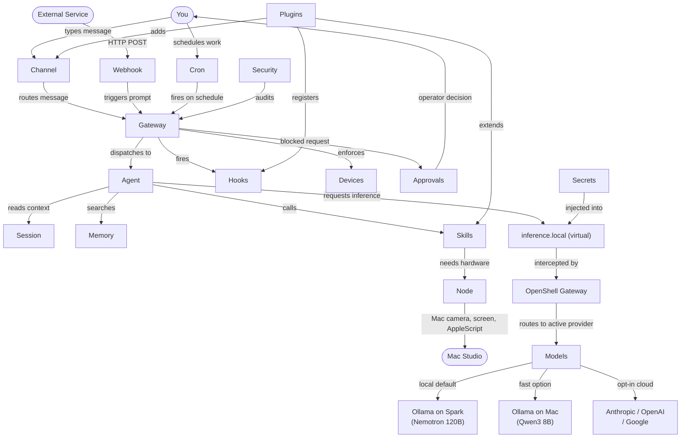

# OpenClaw Conceptual Guide: Understanding Your AI Agent System

*Written for NemoClaw users on DGX Spark + Mac Studio + Raspberry Pi. This is a mental model guide, not a command reference — every section explains what something IS and why it exists.*

---

## The Big Picture

Before going concept by concept, here is how everything fits together. Every request from you to the agent touches multiple layers of this diagram:

```
Gateway (the brain — runs inside nemoclaw-main sandbox)
  ├── Agents (isolated AI personalities)
  │   ├── Sessions (conversation threads)
  │   ├── Memory (persistent knowledge files)
  │   └── Skills (modular capabilities)
  ├── Channels (communication endpoints)
  │   ├── Telegram, Discord, WhatsApp, IRC...
  │   └── Web UI (Control Dashboard — your browser at :18789)
  ├── Nodes (companion devices)
  │   ├── Mac Studio (screen, camera, AppleScript, voice)
  │   └── iOS (camera, location, voice)
  ├── Models (inference providers)
  │   ├── Local — Ollama/LM Studio on Spark or Mac (DEFAULT)
  │   └── Cloud — Anthropic, OpenAI, Google (OPT-IN)
  ├── Cron Jobs (scheduled tasks)
  ├── Plugins (extensions that add new capabilities)
  ├── Hooks (event triggers that fire on agent events)
  └── Security (policies, approvals, device pairing)
```

The critical insight about your NemoClaw deployment: OpenClaw runs **inside an OpenShell sandbox**. OpenShell provides the isolation, network control, and inference routing. OpenClaw provides the agent logic, browser UI, and all the concepts below. They are separate systems that work together — OpenShell is the container, OpenClaw is the application running inside it.

---

## The Three-Layer Architecture (Why Everything Is the Way It Is)

Your NemoClaw stack has three layers. Understanding these three layers explains every decision in the system:

### Layer 1: Sandboxes — Where Agents Run

Each agent tool (OpenClaw, Claude Code, Codex, Gemini CLI) runs inside an **isolated OpenShell sandbox**. A sandbox is a Linux container with kernel-level isolation: filesystem access is restricted by Landlock LSM, network traffic is controlled by network namespaces, and system calls are filtered by seccomp. Agents can only write to `/sandbox` and `/tmp`. Everything else is read-only or blocked.

Why this matters: an unconstrained AI agent running as your user account can read every file on your system, exfiltrate credentials, and make arbitrary network requests. Sandboxes prevent all of this by default.

### Layer 2: Guardrails — What Agents Can Do

Between the agent and the outside world sits the guardrails layer. Network requests from inside a sandbox go through the OpenShell gateway, which applies declarative YAML policies. Every outbound connection is blocked unless explicitly allowed. When an agent tries to reach an unapproved endpoint, you see a prompt in `openshell term` to approve or deny it.

Why this matters: you stay in control of what your agent reaches. The agent cannot silently send your code to an unapproved service.

### Layer 3: Private Inference Router — Where Intelligence Comes From

All sandboxes call `https://inference.local/v1` for inference. This is not a real hostname — it is a virtual endpoint intercepted by the OpenShell gateway's TLS proxy. The gateway looks up the currently active provider, injects the real credentials, and forwards the request. The sandbox never sees the real API key or endpoint.

Why this matters: you can switch between Nemotron 120B on the Spark, Qwen3 8B on the Mac, Claude via Anthropic's API, or any other provider in about five seconds — without restarting any sandbox. The inference source is hot-swappable.

---

## Core Concepts

### 1. The Gateway

**What it is:** The OpenClaw gateway is a WebSocket server that acts as the central coordinator for everything in OpenClaw. It manages agents, routes incoming messages from channels to the right agent, handles session state, and exposes the browser-based Control Dashboard (the chat UI at port 18789).

**Why it exists:** Without a central coordinator, every channel would need to know about every agent, every agent would need to know about every model, and connecting a new device would require reconfiguring everything. The gateway is the single point of truth: all channels connect TO it, all agents register WITH it, all nodes pair THROUGH it.

**Relationship to other concepts:** Everything else in OpenClaw either connects to the gateway or is managed by it. The gateway is started with `openclaw gateway run` inside the `nemoclaw-main` sandbox. On your deployment, it runs continuously in the background.

**In your deployment:** The gateway runs inside the `nemoclaw-main` sandbox on the Spark. It is exposed to the outside world on port 18789. Tailscale Serve puts HTTPS in front of it so you can reach it at `https://spark-caeb.tail48bab7.ts.net/`.

**Practical examples:**
- When you open the browser UI and type a message, that message goes to the gateway via WebSocket.
- When your Mac companion app connects, it connects to this same gateway via WebSocket over Tailscale.

---

### 2. Agents

**What they are:** An agent is an isolated AI personality with its own workspace, memory, skill configuration, and model routing. Each agent is a named entity that the gateway knows about and routes messages to. The default agent created during `openclaw onboard` is called `main`.

**Why they exist:** You might want one agent focused on coding (with GitHub skills enabled, code execution allowed), another focused on research (with web browsing enabled), and a personal assistant for general questions. Agents let you maintain these distinct configurations without them interfering with each other. Each agent has its own context, its own history, its own allowed skills.

**Relationship to other concepts:** An agent is the container that sessions, memory, and skills belong to. Channels are bound to agents — when a Telegram message arrives, the gateway routes it to whichever agent is bound to that channel. The agent uses the currently configured model for inference.

**In your deployment:** You have one agent (`main`) using `nemotron-3-super:120b` via `inference.local`. You could add a second agent bound to a different channel and configured to always use the fast Mac model for a lightweight personal assistant use case.

**Practical examples:**
- `openclaw agents add coding-agent --model nemotron-3-super:120b` creates a specialized coding agent.
- `openclaw agents bind coding-agent --channel telegram --target @mycodingbot` routes Telegram messages from that bot to the coding agent specifically.

---

### 3. Sessions

**What they are:** A session is a conversation thread between a user and an agent. It contains the message history that the agent uses as context. Sessions are keyed by channel and peer — so your conversation in the browser is a different session from your conversation in Telegram, even if both go to the same agent.

**Why they exist:** Conversation context is stateful. If you ask the agent "now add error handling" without context from your previous messages, it has no idea what "it" refers to. Sessions maintain that context. They also allow you to have multiple parallel conversations on different topics without them blending together.

**Relationship to other concepts:** Sessions belong to an agent. The channel a message arrives on determines which session it belongs to (along with the identity of who sent it). Memory is separate from sessions — sessions are temporary context windows, memory is long-term persistent knowledge.

**In your deployment:** When you open the browser UI, you start or continue a session. Each browser tab that opens a chat creates its own session. If you connect via the OpenClaw TUI inside the sandbox, that is yet another session.

**Practical examples:**
- `openclaw sessions` lists all sessions across all agents.
- Typing `/new` in any chat interface starts a fresh session, clearing the conversation context. Use this when you want to switch topics without the agent carrying over old context.
- `openclaw sessions prune` removes old sessions to free up storage.

---

### 4. Memory

**What it is:** Memory is a set of persistent knowledge files stored in the agent's workspace directory. Unlike sessions (which are temporary conversation context), memory persists indefinitely across sessions and gateway restarts. The agent can search memory to retrieve relevant information before responding.

**Why it exists:** An agent without persistent memory is amnesiac — every conversation starts from scratch. With memory, the agent can remember your preferences, your project context, your coding conventions, recurring decisions, or anything else you want it to keep. Memory bridges the gap between ephemeral conversations and lasting knowledge.

**How it works:** Memory is stored as text files in the agent's workspace (inside the sandbox at `/sandbox/.openclaw/agents/<name>/memory/`). These files are indexed so the agent can do semantic search across them. When you ask a question, the agent can retrieve relevant memory chunks before formulating a response. You can also explicitly add, edit, or remove memory files.

**Relationship to other concepts:** Memory belongs to an agent and persists across sessions. Sessions are the short-term working context; memory is the long-term knowledge base. Skills (like file management) can interact with the agent's workspace to add new content to memory.

**Practical examples:**
- `openclaw memory search "database schema"` searches all memory files for information about your database schema.
- `openclaw memory index` rebuilds the search index after you manually add files to the memory directory.
- You can add a file like `PREFERENCES.md` to the memory directory with your coding style preferences, and the agent will reference it automatically.

---

### 5. Skills

**What they are:** Skills are modular capabilities that the agent can use. A skill is not just a single function — it is a package of related tools that give the agent the ability to do something specific: interact with GitHub, execute code, browse the web, manage files, send notifications, etc. Skills must be explicitly enabled; they are not on by default.

**Why they exist:** An agent with all possible capabilities enabled is both risky and noisy. You probably do not want your research assistant to be able to delete files or push commits. Skills let you define exactly what each agent can do. Keeping skills minimal is a security practice — a compromised or misbehaving agent can only use what you gave it.

**How they work:** Skills have requirements — binaries that must be present, API keys that must be set, or network endpoints that must be allowed. The `openclaw skills check` command tells you which skills are ready to use and which are missing dependencies. Skills can be added via `nemoclaw <name> policy-add <skill-name>`, which adds the corresponding policy preset to the sandbox.

**Relationship to other concepts:** Skills belong to an agent. Enabling a skill often requires both an OpenClaw skill configuration AND an OpenShell policy preset — the former tells the agent it can use the capability, the latter tells the sandbox to allow the network access the skill needs. Plugins can add new skills to the system.

**Common skills in your deployment:**
- GitHub integration (requires `nemoclaw nemoclaw-main policy-add github`)
- Web browsing (uses the Browser subsystem)
- Code execution (uses sandbox shell access)
- File management (reads/writes within the sandbox workspace)

**Practical examples:**
- `openclaw skills list` shows every skill OpenClaw knows about and whether it is enabled.
- `openclaw skills check` shows which enabled skills are ready and which are missing something (binary not found, API key not set, network policy missing).

---

### 6. Channels

**What they are:** Channels are the communication endpoints through which users can reach the agent. A channel is the mechanism by which a conversation arrives at the gateway. The browser-based Control Dashboard is one channel. Telegram is another. Discord, WhatsApp, Slack, IRC, and SMS are others.

**Why they exist:** You want to talk to your agent from wherever you are — sometimes from the browser on your Mac, sometimes from Telegram on your phone, sometimes from a terminal via the TUI. Channels abstract away the transport so the agent does not care where a message came from. The gateway handles the translation.

**How they work:** Each channel has its own configuration: a Telegram bot requires a bot token, a Discord integration requires a bot token and server permissions, a custom webhook requires an endpoint. Once configured, the gateway listens for messages on that channel and routes them to the bound agent. Each channel type has its own authentication and pairing rules.

**The Web UI as a channel:** The browser-based Control Dashboard at `https://spark-caeb.tail48bab7.ts.net/` is the default channel. It connects to the gateway via WebSocket and provides the chat interface. It is "just a channel" — functionally equivalent to Telegram or Discord, just delivered through a browser.

**Relationship to other concepts:** Channels are bound to agents (`openclaw agents bind <agent> --channel <type> --target <id>`). One agent can be bound to multiple channels. Sessions are scoped by channel — your Telegram conversation and your browser conversation are separate sessions even to the same agent.

**Practical examples:**
- `openclaw channels add telegram --token BOT_TOKEN` registers a Telegram bot. After this, messages to that bot route through the gateway.
- `openclaw channels list` shows every configured channel and which agent it is bound to.
- Binding the same agent to both Telegram and the web UI means you can switch between them mid-task and the agent has separate sessions for each.

---

### 7. Nodes

**What they are:** Nodes are companion devices — other machines or apps that connect to the gateway and expose hardware capabilities that the agent would not otherwise have access to. Your Mac Studio running the OpenClaw node host is a node. An iPhone running the OpenClaw iOS app is a node.

**Why they exist:** The OpenClaw agent runs inside a sandbox on the DGX Spark. That sandbox has no screen, no camera, no microphone, and no access to macOS system features. Nodes solve this. The Mac node host connects to the gateway and says "I can take screenshots, record audio, run AppleScript, send notifications, and access the clipboard." The agent can then invoke those capabilities remotely, even though it is running on a different machine.

**How they work:** Nodes connect to the gateway via WebSocket and must complete a device pairing flow before the gateway accepts them (see Devices and Pairing below). Once paired, the gateway can delegate node capabilities to the agent as tools. The Mac node host is installed as a macOS launchd service (`ai.openclaw.node`) so it starts automatically on boot.

**Mac node capabilities:**
- Screen capture (take a screenshot of your Mac's display)
- Camera (access the webcam)
- Canvas (draw or annotate)
- AppleScript execution (control macOS applications)
- Native notifications (send a macOS notification from the agent)
- Clipboard access
- Microphone and voice wake

**iOS node capabilities (if you install the iOS app):**
- Camera (photo and video)
- Location (GPS coordinates)
- Voice input

**Relationship to other concepts:** Nodes extend the agent's effective skill set with hardware capabilities. They connect to the Gateway via WebSocket, just like browsers do. They must be paired through the Devices mechanism before they are trusted.

**In your deployment:** The Mac Studio runs the node host as a launchd service. It connects to the gateway at `https://spark-caeb.tail48bab7.ts.net/` over Tailscale. Once connected, the agent on the Spark can take screenshots of your Mac, run AppleScript, and send notifications.

**Practical examples:**
- `openclaw node status` (run on the Mac) shows whether the node host is running and connected to the gateway.
- `openclaw nodes list` (run inside the `nemoclaw-main` sandbox) shows all connected and paired nodes.
- When the agent is helping you with a UI bug, it can call the Mac node's screen capture tool to see what you are seeing.

---

### 8. Models

**What they are:** A model configuration in OpenClaw defines which LLM inference provider to use and which model to request from it. In your deployment, the model configuration inside OpenClaw is layered on top of the inference routing controlled by OpenShell.

**Why they exist:** You might want to use Nemotron 120B for complex reasoning, Qwen3 8B on the Mac for fast replies, or Claude via Anthropic's API for tasks that require frontier capabilities. The models system lets you define and switch between these without reconfiguring the agent itself.

**Two layers of model switching:**

The first layer is **OpenShell's inference router** (`openshell inference set`). This controls which actual server and model all sandboxes talk to via `inference.local`. This is the hot-swap mechanism — change it and every sandbox immediately starts using the new provider.

The second layer is **OpenClaw's model configuration** (`openclaw models`). This is how the agent inside the sandbox selects which model to request from whatever endpoint `inference.local` currently points to. In practice, you will switch models primarily via `openshell inference set` because that is the faster, gateway-level mechanism.

**Relationship to other concepts:** Models are configured per-agent. The active model affects every session that agent has. Switching models during an active conversation changes the model for subsequent messages but does not affect the session history.

**In your deployment:** The active inference route is set at the OpenShell level. Currently `local-ollama` with `nemotron-3-super:120b`. Available providers: `local-ollama` (Spark), `local-lmstudio` (Spark, OpenAI-compatible API), `local-lmstudio-anthropic` (Spark, Anthropic-compatible API), `mac-ollama` (Mac Studio).

**Practical examples:**
- `openclaw models status` shows the model the agent is currently configured to use.
- `openclaw models scan` discovers what models are available at the configured endpoint.
- `openshell inference set --provider mac-ollama --model qwen3:8b` switches the entire system to the fast Mac model in about 5 seconds, no sandbox restart needed.

---

### 9. Cron Jobs

**What they are:** Cron jobs are scheduled tasks that the agent runs automatically at defined intervals. They use standard cron syntax to define the schedule, and the task is expressed as a prompt to the agent — the agent receives the prompt, uses its tools and skills, and executes the work.

**Why they exist:** Not every task requires you to initiate it. Daily summaries, periodic health checks, scheduled reports, reminder digests, automatic backups — all of these are recurring tasks that the agent can own. Cron jobs turn the agent from a reactive tool into a proactive one.

**How they work:** Cron jobs are managed by the gateway's built-in scheduler. When a job's schedule fires, the gateway creates a new session for the agent with the defined prompt, executes the agent's response (including any tool calls), and completes. The output can be delivered to a channel (e.g., send the daily summary to Telegram) or stored in memory.

**Relationship to other concepts:** Cron jobs trigger agent sessions on a schedule. They run through the gateway (so the gateway must be running). The agent processes them using whatever skills and channels are configured. Hooks can fire before and after cron job execution.

**Practical examples:**
- `openclaw cron add "0 9 * * *" "Summarize my GitHub notifications from the past 24 hours and list anything that needs my attention"` — a morning digest at 9am.
- `openclaw cron add "*/30 * * * *" "Check if the OpenShell gateway is healthy and alert me on Telegram if any sandbox is not Ready"` — a 30-minute health watchdog.
- `openclaw cron list` shows all scheduled jobs and their next run time.

---

### 10. Plugins

**What they are:** Plugins are extensions that add new capabilities to OpenClaw without modifying its core code. A plugin can add new CLI commands, new skill types, new channel integrations, new hook handlers, or new UI elements. Plugins are installed from registries or local paths.

**Why they exist:** OpenClaw is designed to be extended. Not every integration makes sense in the core product, and NVIDIA's NemoClaw stack adds capabilities specific to the Spark deployment. Plugins are how these additions are packaged and distributed.

**How they work:** Plugins are discovered and loaded when OpenClaw starts. They register their additions with the gateway at startup. Some plugins are purely additive (new commands), others are deeply integrated (new channel types).

**NemoClaw as a plugin:** The `nemoclaw` CLI you use to orchestrate your deployment is itself an OpenClaw plugin. It registers the `nemoclaw` command family, adds blueprint-based sandbox management, and extends OpenClaw with the NemoClaw-specific onboarding flow. This is why `nemoclaw onboard` works — the nemoclaw plugin adds that command.

**Relationship to other concepts:** Plugins can add new skills, channels, hooks, or commands. They extend every other concept in the system.

**Practical examples:**
- `openclaw plugins list` shows all installed plugins and their version.
- `openclaw plugins install <name>` installs a plugin from the OpenClaw registry.
- A plugin might add Slack as a channel type that was not available in the base installation.

---

### 11. Hooks

**What they are:** Hooks are lightweight event handlers that run when specific things happen in the agent lifecycle. A hook is a script or function that fires automatically in response to an event — a new session starting, a message arriving, a skill being invoked, a session ending, or a cron job completing.

**Why they exist:** Hooks let you automate responses to agent events without modifying the agent's core behavior. They are a way to add side-effects to the agent's operation: log something, notify someone, update a file, trigger another system. They are intentionally lightweight — not full agent invocations, just quick automation.

**How they work:** Hooks are defined per-agent and registered with the gateway. When an event fires, the gateway runs the matching hooks in order. Hooks can be written as shell scripts or as JavaScript/TypeScript functions depending on the OpenClaw version.

**Common hook patterns:**
- `session-start`: Load relevant memory context when a new session begins.
- `session-end`: Summarize the session and save key decisions to memory.
- `pre-tool-call`: Log what tool the agent is about to invoke and with what arguments.
- `post-message`: Send a notification when the agent completes a long task.

**Relationship to other concepts:** Hooks fire on agent events and can interact with memory, sessions, and channels. They complement cron jobs — cron is for scheduled triggers, hooks are for event-driven triggers.

**Practical examples:**
- `openclaw hooks list` shows all available hook points and which ones have handlers registered.
- A `session-memory` hook that runs on `session-start` can automatically search memory for context relevant to the first message and prepend it to the agent's system prompt.
- A hook on `cron-complete` can push the result of a scheduled job to a Telegram channel.

---

### 12. Browser

**What it is:** The Browser subsystem is OpenClaw's dedicated Chromium instance for web browsing. It gives the agent the ability to navigate websites, fill forms, click buttons, take screenshots of pages, extract structured data, and interact with the web as if it were a user.

**Why it exists:** Many tasks require actually visiting a website — checking documentation, reading a news article, filling out a form, scraping data that has no API. A local Chromium instance that the agent controls directly, rather than just fetching HTML, means the agent can handle JavaScript-rendered pages, handle redirects, and interact with dynamic UIs.

**How it works:** The browser is controlled by the node host running on a machine with a display (your Mac Studio, in your setup). The Mac node host has screen access and can launch and control Chromium. The agent on the Spark sends browser commands to the Mac node, which executes them and returns results (screenshots, extracted text, etc.).

**Relationship to other concepts:** The Browser capability is exposed through a Node (your Mac) and enabled as a Skill. The agent can invoke browser tools when the relevant skill is enabled and a node with screen access is connected.

**Practical examples:**
- The agent can browse to a GitHub issue, read all the comments, and summarize the discussion.
- When you ask "what does this library's API look like?", the agent can navigate to the docs site, pull the relevant page, and extract the signature.
- The agent can fill out a web form by navigating to it and using browser interaction tools.

---

### 13. Devices and Pairing

**What it is:** The device pairing system is how OpenClaw controls which clients are allowed to connect to the gateway. Before any browser, node host, or mobile app can communicate with the gateway, it must go through a pairing approval flow.

**Why it exists:** The OpenClaw gateway exposes a WebSocket endpoint. Without device pairing, anyone who can reach port 18789 (or your Tailscale Serve URL) can connect to it. Device pairing ensures that only explicitly approved clients can establish a persistent connection.

**How it works:** When a new client connects to the gateway, the gateway creates a pairing request and rejects the connection with "pairing required." You then approve the request from inside the sandbox (`openclaw devices approve <request-id>`), and the client is remembered. On subsequent connections, the approved client connects immediately without re-pairing.

**Important distinction:** `openclaw devices list/approve` is for clients that want to pair (browsers, node hosts, iOS apps). `openclaw nodes list` shows nodes that are already paired and connected. These are different commands for different stages of the device lifecycle.

**Relationship to other concepts:** Device pairing is part of the Security subsystem. Nodes cannot function until they are paired. The gateway token (set in the browser URL hash or the node host's environment) is a simpler alternative to device pairing for trusted clients.

**In your deployment:** Your Mac node host was paired during the Mac setup phase. The browser UI uses the gateway token (in the URL hash) as an alternative to device pairing. New browsers or new instances of the iOS app will trigger the pairing flow until approved.

**Practical examples:**
- `openclaw devices list` shows all pending pairing requests and all approved devices.
- `openclaw devices approve mac-studio-node-id` approves the Mac node host pairing request.
- The Mac node host will show "pairing required" in its logs until you approve it. After approval, restart the node host.

---

### 14. Approvals

**What it is:** The approvals system is OpenClaw's mechanism for requiring human confirmation before the agent executes potentially dangerous operations. When an operation is flagged as requiring approval (file deletion, system commands, external API calls not in the allowed list), the agent pauses and waits for you to approve or deny it.

**Why it exists:** AI agents can and do make mistakes. An agent that can autonomously delete files, run shell commands, or push commits to production represents a real risk if it misunderstands your intent. Approvals create a human-in-the-loop checkpoint for high-impact operations.

**How it works:** Approvals integrate with the OpenShell TUI (`openshell term`). When an operation requires approval, it appears in the TUI with context about what is being requested and why. You press `A` to approve (for this instance only) or `D` to deny. Session-level approvals can be escalated to permanent policy changes.

**Two levels of approvals:**
- **OpenClaw-level approvals**: The agent itself asks permission before taking a high-impact action defined in its skill configuration.
- **OpenShell-level approvals**: The sandbox blocks a network request and asks the operator (you) to approve or deny it at the policy level.

**Relationship to other concepts:** Approvals are the operational face of the Security subsystem. They complement network policies (which approve endpoints permanently) with on-the-fly decision-making. Approvals can be configured per-agent — a more trusted agent might have fewer approval requirements.

**Practical examples:**
- When the agent tries to delete a file outside the expected workspace, an approval request fires.
- When Claude Code inside the `claude-dev` sandbox tries to reach `api.github.com` for the first time, the OpenShell TUI shows an approval prompt.
- `openclaw approvals list` shows pending approvals waiting for your input.

---

### 15. Webhooks

**What they are:** Webhooks are HTTP endpoints that the gateway exposes so external services can trigger agent actions. Instead of you initiating a conversation, an external system sends an HTTP POST to the gateway's webhook URL, and the gateway processes it as a prompt to the agent.

**Why they exist:** Many integrations are event-driven: a CI/CD pipeline completes and you want the agent to summarize the test results; a GitHub PR is opened and you want the agent to do an initial review; a monitoring alert fires and you want the agent to investigate and summarize the incident. Webhooks enable this inbound event flow.

**How they work:** You configure a webhook endpoint in OpenClaw, which gives you a URL. You then configure the external service to POST to that URL when the event fires. The gateway validates the request (optional signature verification), translates the payload into a prompt, and runs the agent.

**Relationship to other concepts:** Webhooks are a type of inbound channel — they deliver prompts to the agent from external sources. The response from the agent can be delivered back to the webhook caller, to a channel (e.g., Telegram), or stored in memory.

**Practical examples:**
- A GitHub Actions workflow posts to a webhook after tests complete. The agent receives the test summary and posts analysis to your Telegram channel.
- A monitoring system sends a webhook when CPU usage spikes. The agent runs `nvidia-smi` and `openshell sandbox list` via tool calls and sends you a summary.

---

### 16. Sandbox (OpenShell)

**What it is:** In the context of OpenClaw commands, the `sandbox` subsystem refers to tools for inspecting and interacting with the OpenShell sandbox that OpenClaw is running inside. This is distinct from managing sandboxes with `openshell sandbox` — OpenClaw's sandbox commands are introspective (looking at its own container) rather than administrative.

**Why it exists:** The agent may need to understand its own execution environment — what filesystem paths it can access, what network policies apply to it, what resources it has. The sandbox subsystem provides this self-awareness.

**Relationship to other concepts:** The sandbox is the foundation that everything else runs on. Security, Skills, and Network access are all ultimately enforced by the sandbox.

---

### 17. Secrets

**What they are:** The secrets subsystem manages API keys, tokens, and other sensitive credentials that agents need to use skills and integrations. Rather than hardcoding credentials in configuration files or environment variables visible to the agent, secrets are stored in a secure vault managed by the gateway.

**Why they exist:** An agent that can read its own environment variables can potentially extract credentials and include them in a response or send them to an external service. Secrets management keeps credentials out of the agent's context. The gateway injects credentials into requests (the inference.local mechanism does this for model API keys) rather than exposing them directly.

**How they work:** Credentials are registered with the gateway and referenced by name in configurations. The agent uses the name (e.g., `GITHUB_TOKEN`) and the gateway substitutes the real value when the agent makes a network request. The agent never sees the raw credential.

**In your deployment:** This is why Ollama's API key in the sandbox is set to the placeholder `ollama` — the real routing and credential injection happens at the OpenShell gateway level, not by passing real keys to the agent.

---

### 18. Security

**What it is:** The security subsystem is an audit and hardening toolset. It analyzes your OpenClaw configuration and sandbox policies to identify potential vulnerabilities, misconfigurations, and deviations from best practices. It can also apply common fixes automatically.

**Why it exists:** Running AI agents with tool access on a network-connected machine is inherently risky. The security subsystem helps you understand the attack surface of your deployment and close gaps you may not have noticed. It is especially useful after major configuration changes.

**Relationship to other concepts:** Security touches everything — it analyzes agent permissions, skill configurations, channel access controls, device pairing state, and network policies. It is a meta-layer that reasons about the health of the whole configuration.

**Practical examples:**
- `openclaw security audit` performs a basic audit and reports issues.
- `openclaw security audit --deep` runs a more thorough analysis including network policy coverage and credential exposure.
- `openclaw security audit --fix` automatically resolves common misconfigurations (world-readable config files, missing authentication, etc.).

---

### 19. DNS (in NemoClaw context)

**What it is:** In the OpenClaw CLI, the `dns` subsystem manages DNS-SD (Bonjour/mDNS) discovery — how OpenClaw advertises itself on the local network and how it discovers other nodes. At the infrastructure level, your Pi-hole provides local DNS so you can reach services by name instead of IP.

**Why it exists:** Discovery automation reduces manual configuration. Instead of entering an IP address to connect the Mac companion app to the gateway, the app can discover the gateway via mDNS. Similarly, the Pi-hole DNS names (`spark.lab`, `mac.lab`, `ai.lab`) mean you do not need to memorize Tailscale IPs.

**In your deployment:** Pi-hole on the Raspberry Pi provides three local DNS records: `spark.lab` → Spark's Tailscale IP, `mac.lab` → Mac's Tailscale IP, `ai.lab` → Pi's Tailscale IP. LiteLLM is reachable at `http://ai.lab:4000`. Pi-hole admin is at `http://ai.lab/admin`. These names only resolve if your device uses the Pi as its DNS resolver.

---

## How Concepts Connect: The Full Interaction Map



---

## Common "How Do I..." Questions

### How do I add a Telegram bot so I can chat from my phone?

First, create a bot via Telegram's BotFather and get the bot token. Then inside the `nemoclaw-main` sandbox:

```bash
openclaw channels add telegram --token YOUR_BOT_TOKEN
openclaw agents bind main --channel telegram --target @yourbotname
```

After this, messages to your Telegram bot route to the `main` agent. The conversation is a separate session from your browser chat.

---

### How do I make the agent remember something permanently?

Memory files in the agent's workspace survive sessions and gateway restarts. You have two approaches:

1. Ask the agent directly: "Remember that my preferred Python style is Black + ruff with line length 100." The agent can write this to its memory.
2. Add a file directly: drop a Markdown file into the agent's memory directory inside the sandbox (`/sandbox/.openclaw/agents/main/memory/`) and run `openclaw memory index` to rebuild the search index.

---

### How do I schedule a task to run every morning?

```bash
openclaw cron add "0 8 * * *" "Check my GitHub notifications, summarize anything that needs attention today, and send the summary to Telegram"
```

Standard cron syntax. The gateway runs the prompt at 8am and the agent handles it autonomously.

---

### How do I give the agent a new tool or integration?

Two paths:

1. **Enable an existing skill**: `openclaw skills list` shows what is available. Enable one with `openclaw skills enable <skill-name>`. If it requires a policy preset, run `nemoclaw nemoclaw-main policy-add <skill-name>` to also open the necessary network access.
2. **Install a plugin**: `openclaw plugins install <plugin-name>` adds a new plugin that may register new skills, channel types, or commands.

---

### How do I use a different model for the agent?

At the OpenShell level (fastest, affects all sandboxes):

```bash
openshell inference set --provider mac-ollama --model qwen3:8b
```

Available providers: `local-ollama` (Spark, 120B default), `mac-ollama` (Mac, 8B fast), `local-lmstudio` (Spark, OpenAI-compatible), `local-lmstudio-anthropic` (Spark, Anthropic-compatible).

The switch takes about 5 seconds. No sandbox restart needed.

---

### How do I let the agent browse the web?

Two things need to be true:
1. The Mac node host must be running and connected (`openclaw node status` on the Mac).
2. The browser skill must be enabled for the agent (`openclaw skills enable browser` inside the sandbox).

Once both are true, the agent can use browser tools: navigate to a URL, extract content, take screenshots, fill forms.

---

### How do I connect my phone?

**Browser access (simple):** On any device on your Tailscale network, open `https://spark-caeb.tail48bab7.ts.net/` and authenticate with the token in the URL: `https://spark-caeb.tail48bab7.ts.net/#token=<your-token>`.

**iOS app (richer):** Install the OpenClaw iOS app via TestFlight. Connect it to `https://spark-caeb.tail48bab7.ts.net/` with your gateway token. It will create a pairing request — approve it inside the sandbox with `openclaw devices approve <id>`.

---

### How do I run the agent autonomously without my involvement?

Two mechanisms:

- **Cron jobs**: The agent runs on a schedule, takes action, and delivers output to a channel.
- **Webhooks + Hooks**: External events trigger the agent, and hooks automate responses to internal events.

A fully autonomous workflow might look like: a cron job fires at 9am, the agent checks GitHub, writes a summary to memory, sends a Telegram message. No human involved.

---

### How do I see what the agent did while I was away?

Sessions are recorded by the gateway. Inside the sandbox:

```bash
openclaw sessions               # Lists all sessions with timestamps
openclaw sessions show <id>     # Shows the full conversation in a session
```

At the OpenShell level, you can see what network requests the agent made:

```bash
openshell logs nemoclaw-main --tail    # Stream live sandbox logs
openshell term                          # Real-time TUI with all requests
```

---

### How do I restrict what the agent can do?

Three levers:

1. **Skills**: Disable skills the agent does not need. `openclaw skills disable <skill>`. A disabled skill removes the agent's ability to use that capability.
2. **OpenShell network policies**: Edit the sandbox's YAML policy to remove allowed endpoints. `openshell policy get nemoclaw-main --full > /tmp/policy.yaml`, edit, `openshell policy set nemoclaw-main --policy /tmp/policy.yaml --wait`.
3. **Approvals**: Increase the set of operations that require human approval before execution. `openclaw configure --key approvals.require-file-delete --value true`.

The most powerful restriction is at the OpenShell level — network policies are enforced by the kernel, not by the agent. Even if the agent wants to reach an endpoint, the sandbox blocks it.

---

### How do I use the LiteLLM proxy from my own scripts?

The Pi's LiteLLM proxy at `http://ai.lab:4000/v1` (or `http://100.85.6.21:4000/v1`) accepts OpenAI-compatible requests and routes by model name:

```python
from openai import OpenAI
client = OpenAI(base_url="http://100.85.6.21:4000/v1", api_key="unused")
response = client.chat.completions.create(
    model="nemotron-3-super:120b",   # or "qwen3:8b" for Mac
    messages=[{"role": "user", "content": "your prompt here"}],
)
```

This works from any machine on your Tailscale network and routes to the right inference server automatically.

---

### How do I orchestrate multiple agents on a task?

The Orchestrator runs outside the sandboxes on the Spark host. It delegates subtasks to individual sandboxes via `openshell sandbox connect`:

```bash
source ~/workspace/nemoclaw/orchestrator-env/bin/activate
python3 ~/workspace/nemoclaw/orchestrator/pipeline.py "Build a REST API for user auth"
```

The pipeline breaks the task into phases: research (OpenClaw), implementation (Codex), review (Claude Code). Each phase runs in its own sandbox with its own isolation. See `docs/inter-agent-guide.md` for the full pipeline patterns.

---

## Concept Relationships at a Glance

| Concept | Belongs to | Contains / Uses | Requires |
|---------|-----------|-----------------|----------|
| Gateway | OpenClaw | Agents, Channels, Nodes | OpenShell sandbox to run in |
| Agent | Gateway | Sessions, Memory, Skills | A configured Model |
| Session | Agent | Message history | An Agent |
| Memory | Agent | Knowledge files | Agent workspace |
| Skills | Agent | Tools and integrations | Policy presets (for network access) |
| Channels | Gateway | Sessions (one per user/peer) | Agent binding |
| Nodes | Gateway | Hardware capabilities | Device pairing approval |
| Models | Agent / OpenShell | Inference provider config | OpenShell provider registration |
| Cron Jobs | Gateway | Agent sessions (scheduled) | Gateway to be running |
| Plugins | OpenClaw | Skills, Channels, Hooks | Compatible OpenClaw version |
| Hooks | Agent | Event handlers | Hook scripts or functions |
| Browser | Node (Mac) | Chromium instance | Node connected + skill enabled |
| Devices | Gateway | Pairing requests + approved list | Operator approval |
| Approvals | Gateway / OpenShell | Pending decisions | TUI monitoring (`openshell term`) |
| Webhooks | Gateway | Inbound HTTP triggers | External service integration |
| Security | OpenClaw | Audit reports | Nothing — runs on demand |
| Secrets | Gateway | Credential vault | Initial credential registration |

---

## Mental Model Summary

Think of NemoClaw as three concentric rings:

The **outermost ring** is infrastructure: Tailscale provides the secure network, the Pi provides DNS and monitoring, Ollama/LM Studio provide the raw inference compute. This ring does not care about agents or conversations — it just provides reliable, fast, private computation.

The **middle ring** is OpenShell: sandboxes, network policies, the inference router. This ring enforces the rules. It decides what can connect, what can be reached, and where inference requests go. The middle ring is what makes the whole system trustworthy.

The **innermost ring** is OpenClaw: agents, sessions, memory, skills, channels, nodes, cron jobs, hooks, plugins. This ring is the application — the intelligence layer that understands language, coordinates tools, maintains context, and delivers value. The concepts documented in this guide all live in this innermost ring.

Every request from you passes through all three rings: it arrives via a Channel (OpenClaw), the Agent processes it and calls Skills (OpenClaw), tool calls go through network policies (OpenShell), inference goes to the Private Inference Router (OpenShell), and the actual model runs on Ollama or LM Studio (infrastructure). The response travels back the same path.

Understanding which ring a problem is in tells you which tool to use to fix it: agent behavior problems → OpenClaw commands; network access problems → OpenShell policy; inference problems → Ollama/LM Studio or `openshell inference set`.
