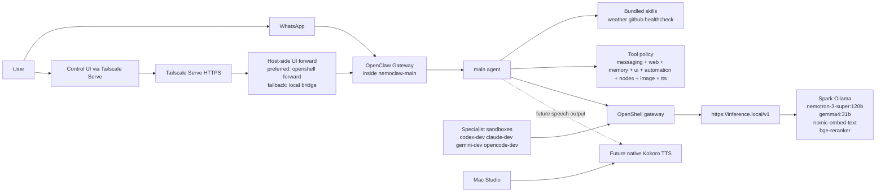

<!-- SPDX-FileCopyrightText: Copyright (c) 2026 NVIDIA CORPORATION & AFFILIATES. All rights reserved. -->
<!-- SPDX-License-Identifier: Apache-2.0 -->

# Personal Assistant Architecture

This is the current target architecture for the NemoClaw personal-assistant deployment.

It is intentionally conservative:

- WhatsApp is the primary ingress channel
- the browser UI remains the operator channel
- OpenClaw owns channels, sessions, skills, and agent behavior
- OpenShell owns isolation, egress policy, and inference routing
- Spark is the reasoning host
- Mac Studio is the future modality host for native TTS

## Topology

## Request Paths

### Primary chat path

1. A message arrives through WhatsApp.
2. The native OpenClaw WhatsApp plugin hands it to the gateway.
3. The gateway routes it to the `main` agent and the correct session.
4. The agent uses the approved tool surface and available skills.
5. Model calls go through OpenShell at `https://inference.local/v1`.
6. OpenShell routes the request to the active Spark model.
7. The response is delivered back through the WhatsApp channel.

### Operator path

1. The browser opens `https://spark-caeb.tail48bab7.ts.net/`.
2. Tailscale Serve terminates HTTPS on the Spark host.
3. Serve proxies to an OpenShell-managed host-local port forward.
4. The forward reaches the loopback-only OpenClaw gateway in `nemoclaw-main`.
5. OpenClaw accepts the request because `gateway.controlUi.allowedOrigins` includes the Serve origin and `gateway.auth.allowTailscale` is enabled.
6. The first browser connection creates a device-pairing request that must be approved once.

That design keeps the gateway bound to loopback inside the sandbox while still giving you HTTPS access from the tailnet.

## Control UI Authentication

The supported operator flow is:

1. Open `https://spark-caeb.tail48bab7.ts.net/`
2. Do **not** put a token in the URL by default
3. Click **Connect**
4. Approve the pending browser/device request from the Spark host:
   - `make devices-list`
   - `make approve-latest-device`
5. Reload the page or click **Connect** again

Important details:

- `gateway.auth.allowTailscale = true` allows the Serve identity path to authenticate the browser
- the shared password is intentionally empty in this deployment
- the live token still exists, but it is a fallback only; print it with `make gateway-token`
- each new browser profile can trigger a new pairing request

### Troubleshooting

If the dashboard shows `unauthorized: too many failed authentication attempts (retry later)`:

1. open a fresh private/incognito window
2. load `https://spark-caeb.tail48bab7.ts.net/` without a token in the URL
3. run `make devices-list`
4. approve the newest pending request with `make approve-latest-device`
5. reconnect

That error usually means the browser kept retrying with a stale cached token or mismatched auth state. The correct recovery is to use the Tailscale Serve + device-pairing flow, not to keep guessing tokens.

## Responsibility Split

### OpenClaw

- channel integration
- session state
- agent orchestration
- skill loading
- Control UI
- device pairing

### OpenShell

- sandbox lifecycle
- network policy
- inference routing
- per-sandbox isolation
- secret and credential separation

### Spark

- main OpenClaw runtime
- OpenShell control plane
- default reasoning models
- future retrieval stack

### Mac Studio

- companion node / operator device
- future native TTS host
- not the default reasoning host in the target architecture

## Live Tool and Skill Posture

### Tools

The main assistant uses:

- `tools.profile = "messaging"`
- `tools.allow = ["group:web", "group:memory", "group:ui", "group:automation", "group:nodes", "image", "tts"]`
- `tools.deny = ["group:runtime", "group:fs", "image_generate", "music_generate", "video_generate"]`

This keeps the assistant useful without turning the WhatsApp-facing agent into a general-purpose code execution environment.

### Skills

Useful now:

- `weather`
- `github`
- `healthcheck`
- `gh-issues` when explicitly asked

Present but intentionally not part of the default behavior:

- `coding-agent`
- `skill-creator`

## Channel Design

### WhatsApp

- primary ingress
- native OpenClaw plugin
- gateway-owned linked session
- default DM policy: `pairing`
- default group policy: `open`
- channel-initiated config writes disabled

### Control UI

- operator channel
- served through Tailscale HTTPS
- explicitly allowed origin
- Tailscale-auth path enabled

### Telegram

- optional secondary ingress
- not the primary daily channel

## Why This Design

This layout follows the upstream OpenClaw model instead of fighting it:

- native channels stay in OpenClaw
- tool policy is configured with `tools.profile` plus `allow` and `deny`
- loopback-only gateway remains compatible with Tailscale Serve and device pairing
- OpenShell remains the isolation and inference boundary

That gives you a personal assistant that is practical to use today and still leaves room for the next session's work on TTS and the separate second-brain service.
