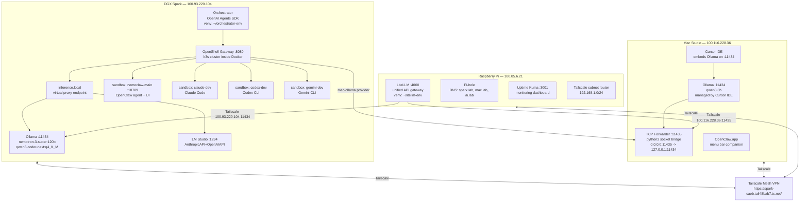
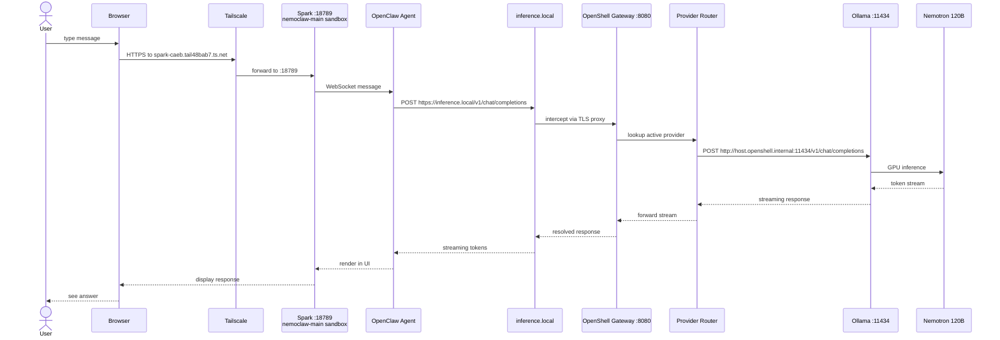
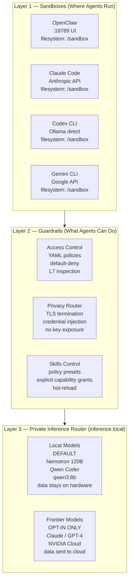
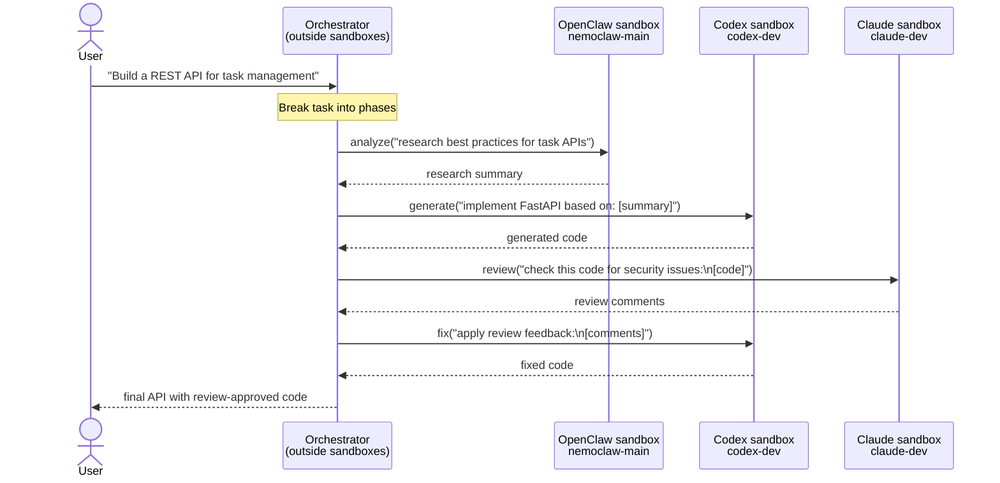

# NemoClaw Multi-Machine Deployment Runbook

*DGX Spark + Mac Studio M4 Max + Raspberry Pi*
*Deployed: March 2026 | Last updated: 2026-03-22*

---

## Table of Contents

1. [System Overview](#1-system-overview)
2. [Architecture Diagrams](#2-architecture-diagrams)
3. [Deploy from Scratch](#3-deploy-from-scratch)
4. [Stop, Pause, and Resume](#4-stop-pause-and-resume)
5. [Delete Everything (Clean Removal)](#5-delete-everything-clean-removal)
6. [Things to Take Special Care Of](#6-things-to-take-special-care-of)
7. [Tools Available](#7-tools-available)
8. [Recommended Workflows](#8-recommended-workflows)
9. [Future Improvements](#9-future-improvements)
10. [Quick Reference Card](#10-quick-reference-card)

---

## 1. System Overview

NemoClaw is NVIDIA's open-source reference stack for running AI agents safely and privately on your own hardware. It wraps agents (OpenClaw, Claude Code, Codex, Gemini CLI) in isolated sandboxes with declarative network policies, routes all inference through a private router that defaults to local models, and provides a unified control plane across multiple machines.

The deployment runs across three machines: a DGX Spark (GB10 Blackwell, 128 GB UMA) that hosts the 120B Nemotron model, four isolated agent sandboxes, and the OpenShell control plane; a Mac Studio (M4 Max, 36 GB) that provides fast secondary inference with Qwen3 8B and the OpenClaw companion app; and a Raspberry Pi that serves as the infrastructure layer with a unified LiteLLM API gateway, Pi-hole DNS, Uptime Kuma monitoring, and Tailscale subnet routing — all connected via Tailscale mesh VPN.

When fully deployed you get: a browser-based chat interface at `https://spark-caeb.tail48bab7.ts.net/` backed by Nemotron 120B running fully locally; four isolated coding agent sandboxes you can connect to from any terminal; a single API endpoint (`http://100.85.6.21:4000/v1`) that routes to any model on any machine by name; real-time monitoring of all agent activity, network requests, and policy decisions; and the ability to switch inference providers in ~5 seconds without restarting anything.

### How to Access Everything

| What you want | How to access | Type | Where it runs |
|---------------|---------------|------|---------------|
| **Chat with Nemotron 120B** | Open `https://spark-caeb.tail48bab7.ts.net/` in any browser | Web UI | Spark sandbox |
| **Chat with token auth** | `https://spark-caeb.tail48bab7.ts.net/#token=7cfb6a0efd17c1ea4f3cda511ffd5e1528ec013d9e8c6634` | Web UI | Spark sandbox |
| **Use Claude Code** | `openshell sandbox connect claude-dev` on Spark terminal | Terminal | Spark sandbox |
| **Use Codex** | `openshell sandbox connect codex-dev` on Spark terminal | Terminal | Spark sandbox |
| **Use Gemini CLI** | `openshell sandbox connect gemini-dev` on Spark terminal | Terminal | Spark sandbox |
| **Use OpenClaw TUI** | `openshell sandbox connect nemoclaw-main` then `openclaw tui` | Terminal | Spark sandbox |
| **Monitor all agents** | `openshell term` on Spark terminal | Terminal TUI | Spark host |
| **Switch models** | `openshell inference set --provider <name> --model <model>` | CLI | Spark host |
| **Call any model via API** | `curl http://100.85.6.21:4000/v1/chat/completions -d '{"model":"..."}'` | REST API | Pi (LiteLLM) |
| **See available models** | `curl http://100.85.6.21:4000/v1/models` | REST API | Pi (LiteLLM) |
| **Check uptime** | Open `http://100.85.6.21:3001` in browser | Web dashboard | Pi |
| **Manage DNS** | Open `http://100.85.6.21/admin` in browser | Web dashboard | Pi |
| **Delegate to agents** | `python -m orchestrator delegate --agent codex --prompt "..."` | CLI | Spark host |
| **Run agent pipeline** | `python -m orchestrator pipeline --steps "gemini:research,codex:implement"` | CLI | Spark host |
| **Mac companion status** | `openclaw node status` on Mac terminal | CLI | Mac |
| **GPU usage** | `nvidia-smi` on Spark terminal | CLI | Spark host |
| **Loaded models** | `ollama ps` on Spark terminal | CLI | Spark host |

**API endpoints at a glance:**

| Endpoint | URL | Format | Auth |
|----------|-----|--------|------|
| NemoClaw UI | `https://spark-caeb.tail48bab7.ts.net/` | Web (HTML) | Token in URL hash |
| Spark Ollama | `http://100.93.220.104:11434/v1/chat/completions` | OpenAI-compatible JSON | None |
| Spark LM Studio | `http://100.93.220.104:1234/v1/chat/completions` | OpenAI + Anthropic JSON | None |
| Mac Ollama | `http://100.116.228.36:11435/v1/chat/completions` | OpenAI-compatible JSON | None |
| Pi LiteLLM (unified) | `http://100.85.6.21:4000/v1/chat/completions` | OpenAI-compatible JSON | API key if configured |
| Sandbox inference | `https://inference.local/v1/chat/completions` | OpenAI-compatible JSON | Injected by OpenShell |

**API usage examples:**

```bash
# Chat with Nemotron 120B directly (from any machine on Tailscale)
curl http://100.93.220.104:11434/v1/chat/completions \
  -H "Content-Type: application/json" \
  -d '{"model":"nemotron-3-super:120b", "messages":[{"role":"user","content":"hello"}]}'

# Chat with qwen3:8b on Mac (fast responses)
curl http://100.116.228.36:11435/v1/chat/completions \
  -H "Content-Type: application/json" \
  -d '{"model":"qwen3:8b", "messages":[{"role":"user","content":"hello"}]}'

# Use LiteLLM unified endpoint — routes to right machine by model name
curl http://100.85.6.21:4000/v1/chat/completions \
  -H "Content-Type: application/json" \
  -d '{"model":"nemotron-3-super:120b", "messages":[{"role":"user","content":"hello"}]}'

# Use from Python (any machine on Tailscale)
from openai import OpenAI
client = OpenAI(base_url="http://100.85.6.21:4000/v1", api_key="unused")
response = client.chat.completions.create(
    model="nemotron-3-super:120b",
    messages=[{"role": "user", "content": "What is NemoClaw?"}],
)
print(response.choices[0].message.content)
```

---

## 2. Architecture Diagrams

### 2.1 Component Diagram



### 2.2 Request Flow Sequence Diagram



### 2.3 Architecture Layer Diagram



### 2.4 Orchestrator Interaction Diagram



---

## 3. Deploy from Scratch

### Prerequisites Checklist

Before starting, verify the following on each machine:

**DGX Spark**

```bash
# Verify hardware and software
docker --version           # 29.x or newer
node --version             # v20 or newer
python3 --version          # 3.11 or newer
ollama list                # nemotron-3-super:120b and qwen3-coder-next:q4_K_M present
lms --version              # LM Studio CLI installed
tailscale status           # Connected (IP: 100.93.220.104)
df -h /                    # Verify sufficient disk space (models are large)
nvidia-smi                 # GPU visible, driver loaded
```

**Mac Studio**

```bash
ollama list                # qwen3:8b (or pull it: /usr/local/bin/ollama pull qwen3:8b)
tailscale status           # Connected (IP: 100.116.228.36)
python3 --version          # 3.x for TCP forwarder
```

**Raspberry Pi**

```bash
tailscale status           # Connected (IP: 100.85.6.21)
python3 --version          # 3.x for LiteLLM
free -h                    # ~2.2 GB available — LiteLLM runs fine at ~300 MB
```

**OpenShell installed on Spark**

```bash
# OpenShell should already be in a venv:
ls ~/workspace/nemoclaw/openshell-env/bin/openshell
# If not, install:
python3 -m venv ~/workspace/nemoclaw/openshell-env
source ~/workspace/nemoclaw/openshell-env/bin/activate
pip install openshell
```

**NemoClaw CLI installed on Spark**

```bash
nemoclaw --version
# If not installed:
npm install -g nemoclaw
```

---

### Phase 1: DGX Spark — Core Stack

#### Step 1.1: Configure Ollama

Ollama must listen on all interfaces (not just `127.0.0.1`) so that sandboxes (which are containers) can reach it. The `KEEP_ALIVE=-1` prevents the 30-60 second cold start on every idle timeout when the 120B model would otherwise be evicted from GPU memory.

```bash
sudo mkdir -p /etc/systemd/system/ollama.service.d
sudo tee /etc/systemd/system/ollama.service.d/override.conf << 'EOF'
[Service]
Environment="OLLAMA_HOST=0.0.0.0"
Environment="OLLAMA_KEEP_ALIVE=-1"
EOF
sudo systemctl daemon-reload
sudo systemctl restart ollama
```

Verify the fix took effect — must show `*:11434`, not `127.0.0.1:11434`:

```bash
ss -tlnp | grep 11434
# Expected: *:11434
systemctl show ollama -p Environment
# Expected: shows OLLAMA_HOST=0.0.0.0 and OLLAMA_KEEP_ALIVE=-1
```

**Gotcha:** If the override shows `127.0.0.1:11434` after restart, check that the override directory path is correct and run `systemctl daemon-reload` again.

#### Step 1.2: Start LM Studio Headless

LM Studio provides an Anthropic-compatible API alongside Ollama's OpenAI-compatible one, which is useful for agents that speak the Anthropic `/v1/messages` format.

```bash
lms server start --port 1234 --bind 0.0.0.0 --cors
```

**Gotcha:** The `llmster` daemon may already be running from a previous session. The command may report "Failed to verify" but the port is already active. Always check before trying to start:

```bash
ss -tlnp | grep 1234
# If it shows 0.0.0.0:1234 — you're good, daemon already running
```

#### Step 1.3: Start OpenShell Gateway

```bash
source ~/workspace/nemoclaw/openshell-env/bin/activate
openshell gateway start --recreate
```

The `--recreate` flag is required if a previous gateway exists but is not running (common after reboots). The gateway bootstraps a k3s cluster inside Docker — allow ~15 seconds for startup.

Verify:

```bash
openshell status
# Expected: Status: Connected, version 0.0.13-dev.9 or newer
```

#### Step 1.4: Register Inference Providers

The hostname `host.openshell.internal` resolves to the gateway host from inside sandboxes. Never use `localhost` or `127.0.0.1` in provider URLs — containers cannot reach those.

```bash
# Primary: Ollama (Nemotron 120B, Qwen Coder)
openshell provider create \
    --name local-ollama \
    --type openai \
    --credential OPENAI_API_KEY=not-needed \
    --config OPENAI_BASE_URL=http://host.openshell.internal:11434/v1

# Secondary: LM Studio (Anthropic-compatible)
openshell provider create \
    --name local-lmstudio \
    --type openai \
    --credential OPENAI_API_KEY=lm-studio \
    --config OPENAI_BASE_URL=http://host.openshell.internal:1234/v1

# LM Studio as Anthropic-compatible (for Claude Code with local models)
openshell provider create \
    --name local-lmstudio-anthropic \
    --type anthropic \
    --credential ANTHROPIC_API_KEY=lm-studio \
    --config ANTHROPIC_BASE_URL=http://host.openshell.internal:1234
```

Verify:

```bash
openshell provider list
# Should show: local-ollama, local-lmstudio, local-lmstudio-anthropic
```

#### Step 1.5: Set Default Inference Route

```bash
openshell inference set --provider local-ollama --model nemotron-3-super:120b
```

Verify that the gateway can actually reach the model:

```bash
openshell inference get
# Expected: provider=local-ollama, model=nemotron-3-super:120b
```

The gateway validates the endpoint during `set` — if it fails, check that Ollama is listening on `0.0.0.0:11434`.

#### Step 1.6: Create the OpenClaw Sandbox

```bash
openshell sandbox create \
    --keep \
    --forward 18789 \
    --name nemoclaw-main \
    --from openclaw \
    -- openclaw-start
```

- `--keep`: sandbox persists across gateway restarts (critical — without this it disappears on `gateway stop`)
- `--forward 18789`: exposes OpenClaw's chat UI on the host
- `--from openclaw`: pulls the community image with bundled network policies
- `-- openclaw-start`: runs the entrypoint script inside the sandbox

**Gotcha:** The `openclaw-start` script runs `openclaw onboard` which is interactive. If you don't see the wizard, or it defaults to "No" on the security prompt, the setup does not complete. If this happens, connect to the sandbox and run `openclaw onboard` manually (see next step).

#### Step 1.7: Run OpenClaw Onboarding

```bash
openshell sandbox connect nemoclaw-main
# You are now inside the sandbox
openclaw onboard
```

Answer the wizard as follows (exact answers matter):

| Prompt | Answer |
|--------|--------|
| Security acknowledgment | **Yes** |
| Onboarding mode | **QuickStart** |
| Model/auth provider | **Custom Provider** |
| API Base URL | `https://inference.local/v1` |
| API Key | `ollama` |
| Endpoint compatibility | **OpenAI-compatible** |
| Model ID | `nemotron-3-super:120b` |
| Endpoint ID | `custom-inference-local` |
| Channel | **Skip for now** |
| Search | **Skip for now** |
| Skills | **No** |
| Hooks | **Skip for now** |

**Critical mistake to avoid:** Do NOT enter `https://inference.local:11434/v1` or `https://inference.local:11434`. The `inference.local` hostname is a virtual endpoint handled by OpenShell's TLS proxy inside the sandbox — it has no port number. Adding `:11434` results in a 403 error that is difficult to diagnose.

After onboarding, start the OpenClaw gateway inside the sandbox:

```bash
# Still inside the sandbox:
nohup openclaw gateway run > /tmp/gateway.log 2>&1 &
```

Verify end-to-end inference:

```bash
# Still inside the sandbox:
curl -s https://inference.local/v1/chat/completions \
    -H 'Content-Type: application/json' \
    -d '{"model":"nemotron-3-super:120b","messages":[{"role":"user","content":"Say hello in one word"}],"max_tokens":10}'
# Expected: JSON with choices[0].message.content containing Nemotron's reply
```

Exit the sandbox:

```bash
exit
```

Browser access: `http://127.0.0.1:18789/` (or via Tailscale at `http://100.93.220.104:18789/`).

---

### Phase 2: Mac Studio — Secondary Inference

#### The Challenge

The Mac Studio's Ollama is managed by the Ollama.app GUI, which also feeds models into Cursor IDE. Both bind to `127.0.0.1:11434`. Reconfiguring Ollama.app's binding would break Cursor's inline completions.

#### Step 2.1: Pull the Fast Model on Mac

```bash
ssh carlos@100.116.228.36
/usr/local/bin/ollama pull qwen3:8b
```

#### Step 2.2: Start TCP Forwarder on Mac

The TCP forwarder bridges `0.0.0.0:11435` to `127.0.0.1:11434`. Port 11435 (not 11434) avoids conflict with Cursor.

```bash
# On the Mac Studio:
python3 -c "
import socket, threading
def forward(src, dst):
    try:
        while True:
            data = src.recv(65536)
            if not data: break
            dst.sendall(data)
    except: pass
    src.close(); dst.close()

server = socket.socket(socket.AF_INET, socket.SOCK_STREAM)
server.setsockopt(socket.SOL_SOCKET, socket.SO_REUSEADDR, 1)
server.bind(('0.0.0.0', 11435))
server.listen(50)
print('TCP forwarder listening on 0.0.0.0:11435 -> 127.0.0.1:11434')
while True:
    client, _ = server.accept()
    upstream = socket.socket(socket.AF_INET, socket.SOCK_STREAM)
    upstream.connect(('127.0.0.1', 11434))
    threading.Thread(target=forward, args=(client, upstream), daemon=True).start()
    threading.Thread(target=forward, args=(upstream, client), daemon=True).start()
" &
```

**Gotcha:** This forwarder does not survive Mac reboots. It must be restarted after each reboot. See the Future Improvements section for a permanent solution using a launchd plist.

Verify from the Spark:

```bash
curl http://100.116.228.36:11435/api/tags
# Expected: JSON list of models on the Mac
```

#### Step 2.3: Register Mac Provider on Spark

```bash
# On the Spark:
source ~/workspace/nemoclaw/openshell-env/bin/activate
openshell provider create \
    --name mac-ollama \
    --type openai \
    --credential OPENAI_API_KEY=not-needed \
    --config OPENAI_BASE_URL=http://100.116.228.36:11435/v1
```

Test provider switching:

```bash
# Switch to Mac (fast, 8B model)
openshell inference set --provider mac-ollama --model qwen3:8b

# Switch back to Spark (heavy, 120B model)
openshell inference set --provider local-ollama --model nemotron-3-super:120b
```

Switching takes ~5 seconds. No sandbox restart needed.

#### Step 2.4: Install OpenClaw Companion on Mac

OpenClaw provides a headless "node host" service that runs on the Mac and connects to the Spark gateway. It exposes Mac capabilities (screen, camera, AppleScript, notifications) to the NemoClaw agent.

**Install OpenClaw CLI** (already installed if npm-global is set up):

```bash
export PATH="$HOME/.npm-global/bin:$HOME/.nvm/versions/node/v24.13.0/bin:$PATH"
openclaw --version
# Expected: OpenClaw 2026.3.13
```

If not installed:
```bash
npm install -g openclaw
```

**Get the gateway token from the Spark:**

On the Spark, run:
```bash
source ~/workspace/nemoclaw/openshell-env/bin/activate
ssh -o StrictHostKeyChecking=no -o UserKnownHostsFile=/dev/null -o LogLevel=ERROR \
    -o "ProxyCommand=openshell ssh-proxy --gateway-name openshell --name nemoclaw-main" \
    sandbox@openshell-nemoclaw-main \
    "python3 -c \"import json; gw=json.load(open('/sandbox/.openclaw/openclaw.json')).get('gateway',{}); print(gw.get('auth',{}).get('token','NOT FOUND'))\""
```

Save the token — you'll need it for the Mac connection.

**Install the node host service on the Mac:**

```bash
# On the Mac:
export PATH="$HOME/.npm-global/bin:$HOME/.nvm/versions/node/v24.13.0/bin:$PATH"

openclaw node install \
    --host spark-caeb.tail48bab7.ts.net \
    --port 443 \
    --tls \
    --force \
    --display-name "Mac Studio"
```

This creates a launchd service (`ai.openclaw.node`) that auto-starts on boot and connects to the Spark gateway via Tailscale Serve.

**Verify:**
```bash
openclaw node status
# Expected: Runtime: running (pid XXXX, state active)
```

**Test in foreground (for debugging):**
```bash
openclaw node stop
openclaw node run --host spark-caeb.tail48bab7.ts.net --port 443 --tls --display-name "Mac Studio"
```

**Gotcha: 502 errors from the node host** mean the Tailscale Serve proxy can't reach `127.0.0.1:18789` on the Spark. This happens when the OpenShell port forward dies. Fix on the Spark:
```bash
source ~/workspace/nemoclaw/openshell-env/bin/activate
openshell forward start 18789 nemoclaw-main --background
```

The port forward is fragile — it uses an SSH tunnel that can drop. After any Spark reboot or gateway restart, re-run the forward command.

**Approve pairing on the gateway** (first-time only):

The node host creates a device pairing request when it first connects. You must approve it on the gateway side. Note: the node host will disconnect with "pairing required" and you must restart it AFTER approval.

```bash
# On the Spark, inside the sandbox:
openshell sandbox connect nemoclaw-main
openclaw devices list   # Should show "Pending: 1" with "Mac Studio"
openclaw devices approve <request-id>   # Use the Request ID from the list
```

**Important:** Use `openclaw devices list/approve`, NOT `openclaw nodes list/approve`. The `devices` command handles pairing; `nodes` shows already-paired nodes.

After approval, restart the node host on the Mac — it should now connect without "pairing required".

**Make it persistent with token auth:**

The launchd plist needs `OPENCLAW_GATEWAY_TOKEN` to authenticate. Add it with:
```bash
# On the Mac:
python3 -c "
import plistlib
plist_path = '$HOME/Library/LaunchAgents/ai.openclaw.node.plist'
with open(plist_path, 'rb') as f:
    plist = plistlib.load(f)
plist.setdefault('EnvironmentVariables', {})['OPENCLAW_GATEWAY_TOKEN'] = '<your-gateway-token>'
with open(plist_path, 'wb') as f:
    plistlib.dump(plist, f)
"
# Reload the service
launchctl bootout gui/$(id -u)/ai.openclaw.node 2>/dev/null
launchctl bootstrap gui/$(id -u) ~/Library/LaunchAgents/ai.openclaw.node.plist
```

#### Step 2.5: Install OpenClaw.app (Mac Companion)

OpenClaw.app is a native macOS menu-bar companion that connects to the NemoClaw gateway on the Spark via WebSocket. It gives you:

- **Menu bar quick access** — click to open chat without a browser
- **Voice wake** — trigger the agent with a spoken phrase
- **Native notifications** — get alerts when the agent completes tasks
- **macOS tools** — exposes Screen Recording, Camera, Canvas, and AppleScript automation to the agent
- **System integration** — Accessibility, Microphone, Speech Recognition

**Install:**

1. Download OpenClaw.app from [openclaw.ai](https://docs.openclaw.ai/platforms/macos) or the project's GitHub releases
2. Move to `/Applications/` and launch
3. Grant macOS permissions when prompted:
   - Notifications
   - Accessibility
   - Screen Recording (optional — for screen capture tool)
   - Microphone (optional — for voice wake)
   - Speech Recognition (optional — for voice wake)

**Connect to the Spark gateway:**

The app connects via WebSocket to the OpenClaw gateway running in the `nemoclaw-main` sandbox.

- **LAN (same network):** The app auto-discovers the gateway via Bonjour if both machines are on the same network
- **Tailscale:** Enter the Tailscale Serve URL: `https://spark-caeb.tail48bab7.ts.net/`
- **Manual:** Enter `ws://100.93.220.104:18789` (Spark's Tailscale IP + port)

If the gateway uses token auth (it does by default), append the token:
```
ws://100.93.220.104:18789?token=<token-from-onboarding>
```

The token was displayed during the `openclaw onboard` step. You can retrieve it:
```bash
# On the Spark, inside the nemoclaw-main sandbox:
openshell sandbox connect nemoclaw-main
grep token ~/.openclaw/openclaw.json
```

**Verify:** The OpenClaw.app icon appears in the Mac menu bar. Clicking it opens a chat window connected to Nemotron 120B on the Spark.

**iOS app (optional):**

For mobile access, install the OpenClaw iOS app via TestFlight (official) or GoClaw / ClawOn from the App Store (third-party). Connect using the Tailscale URL or Spark's Tailscale IP.

---

### Phase 3: Raspberry Pi — Infrastructure Services

#### Step 3.1: LiteLLM Proxy

LiteLLM provides a single API endpoint that routes to any machine by model name. Run in a Python venv — do not install system-wide.

```bash
# On the Pi:
python3 -m venv ~/litellm-env
source ~/litellm-env/bin/activate
pip install "litellm[proxy]"

mkdir -p ~/litellm
cat > ~/litellm/config.yaml << 'EOF'
model_list:
  - model_name: "nemotron-3-super:120b"
    litellm_params:
      model: "ollama/nemotron-3-super:120b"
      api_base: "http://100.93.220.104:11434"
  - model_name: "qwen3-coder-next:q4_K_M"
    litellm_params:
      model: "ollama/qwen3-coder-next:q4_K_M"
      api_base: "http://100.93.220.104:11434"
  - model_name: "qwen3:8b"
    litellm_params:
      model: "ollama/qwen3:8b"
      api_base: "http://100.116.228.36:11435"
EOF
```

Create systemd service:

```bash
sudo tee /etc/systemd/system/litellm.service << 'EOF'
[Unit]
Description=LiteLLM Proxy
After=network.target

[Service]
Type=simple
User=pi
WorkingDirectory=/home/pi/litellm
ExecStart=/home/pi/litellm-env/bin/litellm --config /home/pi/litellm/config.yaml --port 4000 --host 0.0.0.0
Restart=always
RestartSec=5

[Install]
WantedBy=multi-user.target
EOF

sudo systemctl daemon-reload
sudo systemctl enable litellm
sudo systemctl start litellm
```

Verify:

```bash
curl http://100.85.6.21:4000/health
curl http://100.85.6.21:4000/v1/models
```

**Pi RAM note:** The Pi has ~2.2 GB available. LiteLLM proxy uses ~300 MB. Pi-hole uses ~80 MB. Uptime Kuma uses ~150 MB. Total headroom is adequate but do not install additional heavy services.

#### Step 3.2: Pi-hole DNS

Pi-hole provides local DNS so you can use `spark.lab`, `mac.lab`, and `ai.lab` instead of Tailscale IPs.

```bash
curl -sSL https://install.pi-hole.net | bash
# Follow the interactive installer
# After install, add local DNS records via the web UI at http://100.85.6.21/admin
```

Add DNS records in the Pi-hole admin panel (Settings > DNS > Local DNS Records):

| Domain | IP |
|--------|----|
| `spark.lab` | `100.93.220.104` |
| `mac.lab` | `100.116.228.36` |
| `ai.lab` | `100.85.6.21` |

#### Step 3.3: Uptime Kuma

```bash
# On the Pi:
npm install -g pm2
npm install -g uptime-kuma
pm2 start uptime-kuma -- --port 3001
pm2 save
pm2 startup
```

Access at `http://100.85.6.21:3001`. Add monitors for:
- Spark Ollama: `http://100.93.220.104:11434/api/tags`
- Spark OpenShell: `http://100.93.220.104:8080/health`
- Spark OpenClaw UI: `http://100.93.220.104:18789`
- Mac TCP Forwarder: TCP `100.116.228.36:11435`
- LiteLLM Proxy: `http://100.85.6.21:4000/health`

#### Step 3.4: Tailscale Subnet Router

```bash
sudo tailscale up --advertise-routes=192.168.1.0/24 --accept-routes
```

Then approve the route in the Tailscale admin console at `https://login.tailscale.com/admin/machines`. This makes the entire `192.168.1.0/24` LAN accessible to all Tailscale devices through the Pi.

---

### Phase 4: Agent Sandboxes

#### Step 4.1: Claude Code Sandbox

```bash
# On the Spark:
source ~/workspace/nemoclaw/openshell-env/bin/activate
openshell sandbox create --keep --name claude-dev --auto-providers -- claude
```

Authenticate inside the sandbox:

```bash
openshell sandbox connect claude-dev
# Follow the browser authentication prompt that appears
exit
```

#### Step 4.2: Codex Sandbox

```bash
openshell sandbox create --keep --name codex-dev --auto-providers -- bash
```

Connect and configure Codex for local inference:

```bash
openshell sandbox connect codex-dev
# Inside sandbox:
mkdir -p ~/.codex
cat > ~/.codex/config.toml << 'EOF'
model = "nemotron-3-super:120b"
model_provider = "ollama"

[model_providers.ollama]
name = "Ollama (Spark Local)"
base_url = "http://host.openshell.internal:11434/v1"
env_key = "OLLAMA_API_KEY"
wire_api = "responses"
EOF
```

**Gotcha (wire_api):** The `wire_api = "responses"` setting uses Codex's newer Responses API wire format. If you see errors about API format, try `wire_api = "chat"` instead.

**Gotcha (git repo required):** Codex refuses to run in a directory that is not a git repository. Always `cd` into a git repo before running `codex`:

```bash
# Inside codex-dev sandbox:
mkdir -p ~/projects/scratch && cd ~/projects/scratch
git init
codex "explain what this codebase does"
```

Authenticate Codex:

```bash
codex login
exit
```

#### Step 4.3: Gemini CLI Sandbox

```bash
openshell sandbox create --keep --name gemini-dev --auto-providers -- bash
```

Install Gemini CLI inside the sandbox without root:

```bash
openshell sandbox connect gemini-dev
# Inside sandbox:
mkdir -p ~/.npm-global
npm config set prefix ~/.npm-global
export PATH=~/.npm-global/bin:$PATH
npm install -g @google/gemini-cli
echo 'export PATH=~/.npm-global/bin:$PATH' >> ~/.bashrc
```

**Gotcha (sandbox npm permissions):** The sandbox runs as a non-root `sandbox` user. Global npm installs to `/usr/local` fail with `EACCES: permission denied`. Always use `~/.npm-global` as the prefix. This must be set before running `npm install -g`.

Authenticate:

```bash
gemini
# Follow Google OAuth browser flow
exit
```

#### Step 4.4: Final Sandbox State Verification

```bash
openshell sandbox list
```

Expected output:

```
NAME           STATUS   PORTS    CREATED WITH
nemoclaw-main  Ready    18789    --keep --from openclaw
claude-dev     Ready    -        --keep --auto-providers
codex-dev      Ready    -        --keep --auto-providers
gemini-dev     Ready    -        --keep --auto-providers
```

---

### Phase 5: Tailscale Serve

Expose the OpenClaw UI to the internet via Tailscale Serve (encrypted, authenticated):

```bash
# On the Spark:
tailscale serve --bg 18789
```

This creates `https://spark-caeb.tail48bab7.ts.net/` → `http://localhost:18789`. Only Tailscale-authenticated devices can access it.

Verify:

```bash
tailscale serve status
# Should show: https://spark-caeb.tail48bab7.ts.net/ proxying to localhost:18789
```

For public internet access (no Tailscale auth required), use Funnel instead:

```bash
tailscale funnel --bg 18789
# Warning: this exposes the UI to the public internet
```

---

### Phase 6: Orchestrator

The orchestrator runs outside all sandboxes and delegates tasks to agent sandboxes via `openshell sandbox connect`.

#### Step 6.1: Set Up Orchestrator Environment

```bash
# On the Spark:
python3 -m venv ~/workspace/nemoclaw/orchestrator-env
source ~/workspace/nemoclaw/orchestrator-env/bin/activate
pip install openai-agents
```

#### Step 6.2: Create Bridge Tools

```bash
cat > ~/workspace/nemoclaw/orchestrator/sandbox_tools.py << 'EOF'
import subprocess

def run_in_sandbox(sandbox_name: str, command: str, timeout: int = 120) -> str:
    """Execute a command inside an OpenShell sandbox and return output."""
    result = subprocess.run(
        ["openshell", "sandbox", "connect", sandbox_name, "--", "bash", "-c", command],
        capture_output=True,
        text=True,
        timeout=timeout,
    )
    return result.stdout + result.stderr

def claude_analyze(prompt: str) -> str:
    return run_in_sandbox(
        "claude-dev",
        f'openclaw agent --agent main --local -m "{prompt}" --session-id orchestrator'
    )

def codex_generate(prompt: str) -> str:
    return run_in_sandbox(
        "codex-dev",
        f'cd ~/projects/scratch && codex exec "{prompt}"'
    )

def gemini_research(prompt: str) -> str:
    return run_in_sandbox(
        "gemini-dev",
        f'gemini -p "{prompt}"'
    )
EOF
```

#### Step 6.3: Health Check

```bash
source ~/workspace/nemoclaw/orchestrator-env/bin/activate
python3 - << 'EOF'
import subprocess, json

sandboxes = ["nemoclaw-main", "claude-dev", "codex-dev", "gemini-dev"]
result = subprocess.run(
    ["openshell", "sandbox", "list", "--json"],
    capture_output=True, text=True
)
data = json.loads(result.stdout)
running = [s["name"] for s in data if s["status"] == "Ready"]
print(f"Running sandboxes: {running}")
missing = [s for s in sandboxes if s not in running]
if missing:
    print(f"WARNING: Not running: {missing}")
else:
    print("All sandboxes healthy.")
EOF
```

#### Step 6.4: Delegation Test

```bash
source ~/workspace/nemoclaw/orchestrator-env/bin/activate
python3 - << 'EOF'
import subprocess
result = subprocess.run(
    ["openshell", "sandbox", "connect", "codex-dev", "--", "bash", "-c",
     "cd ~/projects/scratch && codex exec 'write hello world in python'"],
    capture_output=True, text=True, timeout=60
)
print(result.stdout)
EOF
```

---

## 4. Stop, Pause, and Resume

### Stop Everything (Ordered Shutdown)

Follow this order to avoid data loss and ensure clean state:

```bash
# 1. Stop the orchestrator (if running as a foreground process)
# Ctrl+C in the terminal running it, or:
pkill -f "orchestrator-env"

# 2. Stop the OpenShell gateway (stops all sandboxes)
source ~/workspace/nemoclaw/openshell-env/bin/activate
openshell gateway stop
# Sandboxes created with --keep will restart automatically when the gateway starts again

# 3. Stop Ollama on Spark (frees 86 GB of GPU memory)
sudo systemctl stop ollama

# 4. Stop LM Studio on Spark
lms server stop

# 5. Stop Mac TCP forwarder
ssh carlos@100.116.228.36 "pkill -f '0.0.0.0.*11435'"

# 6. Stop Pi services (optional — they are lightweight)
ssh pi@100.85.6.21 "sudo systemctl stop litellm"
```

### Stop Individual Components

```bash
# Stop only the OpenShell gateway (sandboxes freeze, Ollama keeps running)
openshell gateway stop

# Stop a single sandbox (others keep running)
openshell sandbox delete codex-dev
# Note: "delete" here removes the running instance; if --keep was used it can be recreated

# Free GPU memory without stopping Ollama (model unloads, cold start on next request)
curl http://localhost:11434/api/generate \
    -d '{"model": "nemotron-3-super:120b", "keep_alive": 0}'

# Stop just LiteLLM on Pi (direct Ollama access still works)
ssh pi@100.85.6.21 "sudo systemctl stop litellm"
```

### Pause Inference (Keep Gateway Running, Unload Models)

Use this when you want to preserve the full NemoClaw setup but free GPU memory temporarily:

```bash
# Unload the 120B model from GPU memory (~86 GB freed)
curl http://localhost:11434/api/generate \
    -d '{"model": "nemotron-3-super:120b", "keep_alive": 0}'

# Unload the coder model if also loaded
curl http://localhost:11434/api/generate \
    -d '{"model": "qwen3-coder-next:q4_K_M", "keep_alive": 0}'

# Verify GPU memory is freed:
nvidia-smi
ollama ps
# Expected: ollama ps shows no loaded models
```

The gateway remains running. The next inference request will trigger a cold start (30-60 seconds for Nemotron 120B).

### Resume After Pause

```bash
# Force-load the model back into GPU (optional — it loads on first request automatically)
curl http://localhost:11434/api/generate \
    -d '{"model": "nemotron-3-super:120b", "keep_alive": -1}' \
    -d '{"prompt": ""}' &
echo "Model loading in background..."
ollama ps  # Check loading progress
```

Or simply send a real request — it will cold-start the model:

```bash
curl -s http://localhost:11434/v1/chat/completions \
    -H 'Content-Type: application/json' \
    -d '{"model":"nemotron-3-super:120b","messages":[{"role":"user","content":"ping"}],"max_tokens":5}'
```

### Resume After Reboot

After a full Spark reboot, Ollama starts automatically (it is a systemd service). The OpenShell gateway does NOT auto-start — it must be started manually:

```bash
# Step 1: Verify Ollama is running
systemctl status ollama
ss -tlnp | grep 11434

# Step 2: Start LM Studio daemon
lms server start --port 1234 --bind 0.0.0.0 --cors

# Step 3: Start OpenShell gateway
source ~/workspace/nemoclaw/openshell-env/bin/activate
openshell gateway start
# Wait ~15 seconds for k3s bootstrap
openshell status

# Step 4: Verify sandboxes restored (--keep flag auto-restores them)
openshell sandbox list
# All four sandboxes should show Ready

# Step 5: Restart Mac TCP forwarder (does not survive reboots)
ssh carlos@100.116.228.36
python3 -c "
import socket, threading
def forward(src, dst):
    try:
        while True:
            data = src.recv(65536)
            if not data: break
            dst.sendall(data)
    except: pass
    src.close(); dst.close()
server = socket.socket(socket.AF_INET, socket.SOCK_STREAM)
server.setsockopt(socket.SOL_SOCKET, socket.SO_REUSEADDR, 1)
server.bind(('0.0.0.0', 11435))
server.listen(50)
while True:
    client, _ = server.accept()
    upstream = socket.socket(socket.AF_INET, socket.SOCK_STREAM)
    upstream.connect(('127.0.0.1', 11434))
    threading.Thread(target=forward, args=(client, upstream), daemon=True).start()
    threading.Thread(target=forward, args=(upstream, client), daemon=True).start()
" &
exit

# Step 6: Verify Pi services (auto-start via systemd)
ssh pi@100.85.6.21 "systemctl status litellm"
```

---

## 5. Delete Everything (Clean Removal)

Use this section when you need to completely remove the NemoClaw deployment and start fresh.

### 1. Delete All Sandboxes

```bash
source ~/workspace/nemoclaw/openshell-env/bin/activate

# Delete each sandbox individually
openshell sandbox delete nemoclaw-main
openshell sandbox delete claude-dev
openshell sandbox delete codex-dev
openshell sandbox delete gemini-dev

# Verify all gone
openshell sandbox list
# Expected: empty list
```

### 2. Destroy the OpenShell Gateway

```bash
openshell gateway destroy
# WARNING: This deletes ALL sandboxes, providers, and the gateway itself.
# There is no confirmation prompt — it runs immediately.
```

### 3. Stop and Remove Ollama Configuration Override

```bash
# Stop Ollama
sudo systemctl stop ollama

# Remove the keep-alive and listen-all override
sudo rm /etc/systemd/system/ollama.service.d/override.conf
sudo systemctl daemon-reload

# Ollama itself stays installed (it has your model weights)
# Only the configuration override is removed
# To also remove Ollama completely:
# sudo systemctl disable ollama
# sudo apt remove ollama  (or whatever package manager was used)
```

### 4. Stop LM Studio

```bash
lms server stop
# LM Studio itself stays installed
# To remove:
# rm -rf ~/.lmstudio
```

### 5. Remove OpenShell

```bash
# Deactivate the venv first
deactivate

# Remove the venv
rm -rf ~/workspace/nemoclaw/openshell-env

# Remove OpenShell config
rm -rf ~/.openshell
```

### 6. Remove NemoClaw CLI

```bash
npm uninstall -g nemoclaw
```

### 7. Remove Orchestrator

```bash
rm -rf ~/workspace/nemoclaw/orchestrator-env
rm -rf ~/workspace/nemoclaw/orchestrator/
```

### 8. Clean Up Pi Services

```bash
ssh pi@100.85.6.21

# Stop and disable LiteLLM
sudo systemctl stop litellm
sudo systemctl disable litellm
sudo rm /etc/systemd/system/litellm.service
sudo systemctl daemon-reload

# Remove LiteLLM venv and config
rm -rf ~/litellm-env ~/litellm

# Stop Uptime Kuma (if using pm2)
pm2 stop uptime-kuma
pm2 delete uptime-kuma

# Revert Tailscale subnet routing
sudo tailscale up --advertise-routes="" --accept-routes=false

# Pi-hole removal (if needed)
pihole uninstall
```

### 9. Clean Up Mac TCP Forwarder

```bash
ssh carlos@100.116.228.36
# Kill the forwarder
pkill -f "0.0.0.0.*11435"
# Verify port is released
ss -tlnp | grep 11435
```

### 10. Revoke Tailscale Serve

```bash
# On Spark:
tailscale serve --remove 18789
tailscale funnel --remove 18789
```

### What to Keep vs What to Delete

| Component | Keep? | Reason |
|-----------|-------|--------|
| Ollama and downloaded models | Yes | Models are large (86 GB for Nemotron); re-download is slow |
| LM Studio and its models | Yes | Same reason |
| Tailscale installation | Yes | Needed for network access |
| Pi-hole | Yes | Useful independently |
| OpenShell venv | Delete | Recreated on redeploy |
| NemoClaw CLI | Your choice | Small, easy to reinstall |
| Sandbox data in `/sandbox` | Delete with gateway destroy | Ephemeral by design |
| `~/.openshell` config | Delete | Provider and gateway config; fresh start on redeploy |

---

## 6. Things to Take Special Care Of

### GPU Memory Management (120B Model = 86 GB)

The DGX Spark has 128 GB of unified memory. Nemotron 120B takes ~86 GB when loaded. The remaining ~42 GB is shared between the OS, other processes, and any second model.

```bash
# Always check before loading a second large model
nvidia-smi --query-gpu=memory.used,memory.free --format=csv,noheader
ollama ps  # See what is currently loaded and using VRAM

# If you see OOM errors, unload models before switching:
curl http://localhost:11434/api/generate \
    -d '{"model": "nemotron-3-super:120b", "keep_alive": 0}'
```

With `OLLAMA_KEEP_ALIVE=-1`, models stay loaded forever. This is intentional — the 30-60 second cold start is unacceptable in interactive use. The trade-off is that you must manually unload if you want to run two large models simultaneously.

### Disk Space Monitoring (69% Used at Deployment)

Model files are large and disk fills up quickly.

```bash
df -h /                             # Overall disk usage
du -sh ~/.ollama/models/            # Space used by Ollama models
du -sh ~/.lmstudio/models/          # Space used by LM Studio models

# Set up a cron alert (on Spark):
echo "0 * * * * df / | awk 'NR==2{if (\$5+0 > 85) print \"DISK ALERT: \" \$5 \" used on Spark\"}'" | crontab -
```

Before pulling new models, verify at least 10 GB of headroom exists.

### Tailscale Serve vs Direct Port Exposure

| Method | Who can access | Auth required | Use when |
|--------|---------------|---------------|----------|
| `tailscale serve` | Tailscale network only | Yes (Tailscale device auth) | Normal use — recommended |
| `tailscale funnel` | Public internet | No | Sharing with external collaborators |
| Direct port `:18789` | LAN + Tailscale | No | Local development only |

Never expose port 18789 directly to the internet without authentication. The OpenClaw UI has no built-in auth.

### Sandbox Persistence (`--keep` Flag)

Sandboxes created with `--keep` survive `openshell gateway stop` and `openshell gateway start`. Without `--keep`, the sandbox disappears when the gateway stops.

```bash
# Check if a sandbox was created with --keep:
openshell sandbox list --verbose
# Look for "persistent: true"

# If you accidentally created without --keep, recreate it:
openshell sandbox delete nemoclaw-main
openshell sandbox create --keep --forward 18789 --name nemoclaw-main --from openclaw -- openclaw-start
```

### Provider Switching During Active Sessions

Switching inference providers while an agent has an active conversation works, but the model context is not transferred. The agent will start a fresh context on the new model.

```bash
# Switch provider (takes ~5 seconds)
openshell inference set --provider mac-ollama --model qwen3:8b

# Verify the switch:
openshell inference get
```

Do not switch providers while a long-running inference request is in progress — it will interrupt the current stream.

### `inference.local` Gotchas

`inference.local` is not a real hostname. It only exists inside OpenShell sandboxes, handled by the gateway's TLS proxy.

Rules to follow:
1. Always use `https://inference.local/v1` — HTTPS, no port number
2. Never use `http://` — the proxy requires TLS
3. Never add a port — `https://inference.local:11434/v1` gives a 403
4. Never use `inference.local` outside a sandbox — it does not resolve on the host

```bash
# Correct (inside sandbox):
curl https://inference.local/v1/models

# Wrong — port number causes 403:
curl https://inference.local:11434/v1/models

# Wrong — HTTP instead of HTTPS causes connection refused:
curl http://inference.local/v1/models
```

### Codex Hardcoded localhost Issue

Codex, by default, tries to reach Ollama at `localhost:11434` — which is unreachable from inside a sandbox (containers cannot reach the host's localhost). The fix is the `~/.codex/config.toml` configuration that uses `host.openshell.internal:11434` instead.

If Codex stops working after a sandbox recreation, re-create the config:

```bash
openshell sandbox connect codex-dev
cat > ~/.codex/config.toml << 'EOF'
model = "nemotron-3-super:120b"
model_provider = "ollama"

[model_providers.ollama]
name = "Ollama (Spark Local)"
base_url = "http://host.openshell.internal:11434/v1"
env_key = "OLLAMA_API_KEY"
wire_api = "responses"
EOF
```

### Mac TCP Forwarder Persistence

The TCP forwarder is a backgrounded Python process that does not survive Mac reboots or SSH session termination. Current workaround: restart it manually after each reboot.

```bash
# Check if it is running on Mac:
ssh carlos@100.116.228.36 "ss -tlnp | grep 11435"

# Restart it if not running:
ssh carlos@100.116.228.36 "python3 /path/to/forwarder.py &"
```

Permanent fix (future work): Create a launchd plist at `~/Library/LaunchAgents/com.nemoclaw.forwarder.plist`.

### Pi RAM Limits (~2.2 GB Available)

The Raspberry Pi has 3.7 GB total, ~2.2 GB available after OS overhead. Current usage:
- LiteLLM proxy: ~300 MB
- Pi-hole: ~80 MB
- Uptime Kuma: ~150 MB
- Available: ~1.7 GB

Do not run Docker on the Pi — it would exhaust RAM. Do not install large Python packages system-wide. Keep everything in venvs.

```bash
# Monitor Pi RAM:
ssh pi@100.85.6.21 "free -h && ps aux --sort=-%mem | head -10"
```

### API Key Security (Subscription Auth, Not Raw Keys)

Claude Code, Codex, and Gemini CLI all use browser-based subscription authentication rather than raw API keys. This is intentional — subscription auth does not expose a key that could be leaked.

```bash
# These agents authenticate via browser OAuth flows — never paste an API key directly:
# Claude Code: browser popup during openshell sandbox connect claude-dev
# Codex: codex login (opens browser)
# Gemini CLI: gemini (opens browser on first run)

# Only Ollama-based inference uses a fake key ("not-needed" or "ollama")
# because Ollama has no real authentication
```

### Network Policy Default-Deny

Every sandbox has default-deny networking. An agent that tries to reach an unapproved endpoint is blocked. This is a feature, not a bug. When you see blocked requests:

```bash
# Start the monitoring TUI to see and approve blocked requests interactively:
openshell term
# Press [A] to approve, [D] to deny, [I] to ignore for current request

# To make an approval permanent, edit the policy:
openshell policy get claude-dev --full > /tmp/claude-policy.yaml
# Edit /tmp/claude-policy.yaml to add the endpoint
openshell policy set claude-dev --policy /tmp/claude-policy.yaml --wait
```

### Port forward fragility

The `openshell forward` command creates an SSH tunnel from `127.0.0.1:18789` on the Spark host to port 18789 inside the sandbox. This tunnel can die silently — when it does, Tailscale Serve returns 502, the browser shows nothing, and the Mac node host can't connect.

**Diagnosis:**
```bash
ss -tlnp | grep 18789
# If empty: port forward is dead
```

**Fix:**
```bash
source ~/workspace/nemoclaw/openshell-env/bin/activate
openshell forward start 18789 nemoclaw-main --background
```

**Prevention:** Add a cron job or systemd timer to check and restart the forward:
```bash
# Check every 5 minutes
*/5 * * * * ss -tlnp | grep -q 18789 || (source ~/workspace/nemoclaw/openshell-env/bin/activate && openshell forward start 18789 nemoclaw-main --background)
```

---

## 7. Tools Available

### 7.1 openshell CLI

The core runtime management tool. Lives in the `openshell-env` venv on the Spark.

```bash
source ~/workspace/nemoclaw/openshell-env/bin/activate
```

**Subcommands:**

| Subcommand | Description |
|------------|-------------|
| `gateway start [--recreate]` | Start the k3s gateway (add `--recreate` if previous gateway exists but not running) |
| `gateway stop` | Stop the gateway (sandboxes freeze; `--keep` sandboxes restore on next start) |
| `gateway destroy` | Destroy everything — gateway, all sandboxes, all providers |
| `status` | Show gateway connection status and version |
| `sandbox create` | Create a new sandbox |
| `sandbox list` | List all sandboxes with status |
| `sandbox connect <name>` | Open a shell inside a sandbox |
| `sandbox delete <name>` | Stop and remove a sandbox |
| `provider create` | Register a new inference provider or credential |
| `provider list` | List all registered providers |
| `provider delete <name>` | Remove a provider |
| `inference set` | Set the active inference route (provider + model) |
| `inference get` | Show the current inference route |
| `policy get <sandbox>` | Get the current policy for a sandbox |
| `policy set <sandbox>` | Apply a new policy to a sandbox (hot-reloads) |
| `logs <sandbox>` | View logs for a sandbox |
| `logs <sandbox> --tail` | Stream live logs |
| `term` | Open the real-time TUI for monitoring and approval |
| `forward <port>` | Forward a local port into a sandbox |

**Examples:**

```bash
# Start gateway after reboot
openshell gateway start

# Create a persistent sandbox with port forwarding
openshell sandbox create --keep --forward 18789 --name my-agent --from openclaw -- openclaw-start

# Switch inference to Mac's fast model
openshell inference set --provider mac-ollama --model qwen3:8b

# Watch what all sandboxes are doing in real time
openshell term

# View live logs for OpenClaw
openshell logs nemoclaw-main --tail

# Export a sandbox's policy for editing
openshell policy get claude-dev --full > /tmp/policy.yaml
```

### 7.2 nemoclaw CLI

The high-level orchestration CLI. Wraps OpenShell with NemoClaw-specific workflows.

**Examples:**

```bash
# Full interactive onboarding wizard
nemoclaw onboard

# DGX Spark-specific setup (cgroup v2, Docker fixes)
nemoclaw setup-spark

# List all NemoClaw sandboxes with model and provider info
nemoclaw list

# Connect to a sandbox
nemoclaw nemoclaw-main connect

# Show health, blueprint state, inference config
nemoclaw nemoclaw-main status

# Stream logs
nemoclaw nemoclaw-main logs

# Delete a sandbox
nemoclaw nemoclaw-main destroy

# Add a policy preset
nemoclaw nemoclaw-main policy-add github
nemoclaw nemoclaw-main policy-add npm-registry
```

### 7.3 openclaw CLI

The AI agent CLI that runs inside sandboxes.

**Examples:**

```bash
# Run the interactive terminal UI (inside sandbox)
openclaw tui

# Send a one-shot prompt to the agent (inside sandbox)
openclaw agent --agent main --local -m "explain this file" --session-id review-001

# Start the OpenClaw gateway (WebSocket server for browser UI)
openclaw gateway run

# Run the onboarding wizard
openclaw onboard

# Configure a specific setting
openclaw configure --key inference.url --value "https://inference.local/v1"

# Run a security audit of the current sandbox policy
openclaw security audit
```

### 7.4 ollama CLI

Model management and inference server for both Spark and Mac.

```bash
# List all downloaded models
ollama list

# Pull a new model
ollama pull nemotron-3-super:120b
ollama pull qwen3:8b

# Run a model interactively (testing only — use inference.local in production)
ollama run nemotron-3-super:120b

# Show what models are currently loaded in GPU memory
ollama ps

# Show model details (size, parameters, quantization)
ollama show nemotron-3-super:120b

# Start Ollama server manually (if not using systemd)
OLLAMA_HOST=0.0.0.0 OLLAMA_KEEP_ALIVE=-1 ollama serve

# Unload a model from GPU memory
curl http://localhost:11434/api/generate \
    -d '{"model": "nemotron-3-super:120b", "keep_alive": 0}'
```

### 7.5 lms CLI (LM Studio)

Manages the LM Studio headless server and model library.

```bash
# Start the headless server
lms server start --port 1234 --bind 0.0.0.0 --cors

# Stop the server
lms server stop

# Check server status
lms status

# Download a model from the LM Studio model hub
lms get bartowski/Nemotron-3-Super-120B-GGUF

# Load a model into the running server
lms load bartowski/Nemotron-3-Super-120B-GGUF

# List downloaded models
lms ls
```

### 7.6 orchestrator CLI / Python API

The orchestrator uses OpenAI Agents SDK and is invoked as a Python script.

```bash
source ~/workspace/nemoclaw/orchestrator-env/bin/activate

# Run a health check across all sandboxes
python3 ~/workspace/nemoclaw/orchestrator/health_check.py

# Show status of all agents
python3 ~/workspace/nemoclaw/orchestrator/status.py

# Delegate a single task to a specific agent
python3 - << 'EOF'
from sandbox_tools import codex_generate
result = codex_generate("write a function that parses JSON from a file")
print(result)
EOF

# Run a full pipeline: research → implement → review
python3 ~/workspace/nemoclaw/orchestrator/pipeline.py \
    "Build a REST API for user authentication"

# Run tasks in parallel across agents
python3 ~/workspace/nemoclaw/orchestrator/parallel.py \
    --agents codex-dev,claude-dev \
    --task "Optimize this function: [paste code]"
```

### 7.7 tailscale CLI

Network management across all three machines.

```bash
# Check connection status and peer IPs
tailscale status

# View what is being served via Tailscale Serve
tailscale serve status

# Expose a local port via Tailscale (Tailscale devices only)
tailscale serve --bg 18789

# Expose a local port to the public internet (no auth)
tailscale funnel --bg 18789

# Remove a Serve or Funnel entry
tailscale serve --remove 18789

# SSH to another Tailscale device (using MagicDNS)
tailscale ssh carlos@spark-caeb
tailscale ssh carlos@100.116.228.36

# Advertise local subnet routes (run on Pi)
sudo tailscale up --advertise-routes=192.168.1.0/24 --accept-routes
```

### 7.8 LiteLLM API

The Pi runs LiteLLM as a unified API proxy. Any OpenAI-compatible client can point at it.

```bash
# Check proxy health
curl http://100.85.6.21:4000/health

# List available models
curl http://100.85.6.21:4000/v1/models

# Chat completions — model routing is automatic based on model name
curl http://100.85.6.21:4000/v1/chat/completions \
    -H "Content-Type: application/json" \
    -d '{
        "model": "nemotron-3-super:120b",
        "messages": [{"role": "user", "content": "hello"}]
    }'

# Route to Mac's fast model by name
curl http://100.85.6.21:4000/v1/chat/completions \
    -H "Content-Type: application/json" \
    -d '{"model": "qwen3:8b", "messages": [{"role": "user", "content": "ping"}]}'

# Use from Python
python3 - << 'EOF'
from openai import OpenAI
client = OpenAI(base_url="http://100.85.6.21:4000/v1", api_key="unused")
response = client.chat.completions.create(
    model="nemotron-3-super:120b",
    messages=[{"role": "user", "content": "what is 2+2?"}],
)
print(response.choices[0].message.content)
EOF

# Reload config without restarting
sudo systemctl reload litellm
```

### 7.9 openshell term (TUI Monitor)

Real-time dashboard showing all sandbox activity. Launch from the Spark host:

```bash
source ~/workspace/nemoclaw/openshell-env/bin/activate
openshell term
```

What the TUI shows:
- All active sandboxes and their status
- Real-time network requests from each sandbox
- Policy decisions (allowed, blocked, pending approval)
- Interactive approval prompts for blocked requests

Keyboard shortcuts inside the TUI:

| Key | Action |
|-----|--------|
| `A` | Approve the highlighted blocked request (session only) |
| `D` | Deny the highlighted blocked request |
| `I` | Ignore (allow once, don't save) |
| `Tab` | Switch between sandboxes |
| `L` | Toggle log view |
| `Q` | Quit |

### 7.10 Uptime Kuma (Web Dashboard)

Browser-based uptime monitoring. Access at `http://100.85.6.21:3001`.

What it monitors:
- Spark Ollama: `http://100.93.220.104:11434/api/tags` (HTTP 200)
- Spark OpenShell Gateway: `http://100.93.220.104:8080/health`
- Spark OpenClaw UI: `http://100.93.220.104:18789` (HTTP 200)
- Mac TCP Forwarder: TCP `100.116.228.36:11435`
- LiteLLM Proxy: `http://100.85.6.21:4000/health`

To add a new monitor:
1. Log in at `http://100.85.6.21:3001`
2. Click "Add New Monitor"
3. Choose type (HTTP/TCP/keyword)
4. Set the URL, interval (60s recommended), and alert contacts

Alerts can be configured for email, Telegram, Slack, and others via Notification settings.

### 7.11 OpenClaw.app (Mac Companion)

Native macOS menu-bar app that connects to the NemoClaw gateway via WebSocket.

**How to connect:** Launch the app, it auto-discovers via Bonjour on LAN. For Tailscale, enter `https://spark-caeb.tail48bab7.ts.net/` or `ws://100.93.220.104:18789`.

Examples:

```
# Chat from the menu bar
Click the OpenClaw icon → type your message → Nemotron responds

# Voice wake (if microphone enabled)
Say the trigger phrase → agent starts listening

# Screen capture tool
The agent can take screenshots of your Mac screen (requires Screen Recording permission)

# AppleScript automation
The agent can run AppleScript commands on your Mac (requires Accessibility permission)
  Example: "Open Safari and go to github.com"

# Native notifications
Get macOS notifications when the agent completes long-running tasks
```

### 7.12 iOS App (Mobile Companion)

Access NemoClaw from your iPhone. Install via TestFlight (official) or GoClaw/ClawOn (App Store).

**How to connect:** Enter Tailscale URL `https://spark-caeb.tail48bab7.ts.net/` or Spark Tailscale IP `100.93.220.104:18789`.

Examples:

```
# Chat on the go
Open app → type message → Nemotron responds from the Spark

# Camera tool
The agent can see through your phone camera (grant Camera permission)

# Location tool
The agent knows your location (grant Location permission)

# Voice mode
Speak to the agent instead of typing (grant Microphone permission)
```

---

## 8. Recommended Workflows

### 8.1 Daily Development Workflow

Start your day with a health check before any work:

```bash
# 1. Verify everything is running
source ~/workspace/nemoclaw/openshell-env/bin/activate
openshell status                    # Gateway connected?
openshell sandbox list              # All four sandboxes Ready?
openshell inference get             # Correct provider and model active?
ollama ps                           # Is Nemotron loaded? (or will cold-start on first request)
nvidia-smi | grep "MiB"             # GPU memory OK?

# 2. If gateway is down, restart it:
openshell gateway start
# Wait 15 seconds, then verify:
openshell status

# 3. Open monitoring TUI in a dedicated terminal window
openshell term

# 4. Open the chat UI in browser
open http://127.0.0.1:18789
# Or via Tailscale from any device:
# https://spark-caeb.tail48bab7.ts.net/

# 5. Connect to your primary coding agent
openshell sandbox connect claude-dev
# or
openshell sandbox connect codex-dev
```

For quick questions during the day, switch to the Mac's faster model:

```bash
openshell inference set --provider mac-ollama --model qwen3:8b
# ... get quick answers ...
openshell inference set --provider local-ollama --model nemotron-3-super:120b
```

### 8.2 Code Review Workflow

Use Claude Code sandbox for reviewing, Codex for implementing fixes:

```bash
# Terminal 1: Connect to Claude Code for review
openshell sandbox connect claude-dev
# Inside claude-dev sandbox:
claude
# Ask Claude to review your code:
# "Review the code in /sandbox/myproject for security issues and code quality"

# Terminal 2: Connect to Codex for implementing fixes
openshell sandbox connect codex-dev
# Inside codex-dev sandbox:
cd ~/projects/myproject
codex "implement the following fixes: [paste Claude's review]"

# Terminal 3 (optional): Run the orchestrator pipeline
source ~/workspace/nemoclaw/orchestrator-env/bin/activate
python3 ~/workspace/nemoclaw/orchestrator/pipeline.py \
    "Review and fix the code in /sandbox/myproject"
# The orchestrator will delegate to Claude (review) then Codex (fix) automatically
```

Monitor policy decisions in a fourth terminal:

```bash
openshell term
# Watch for any blocked requests and approve as needed
```

### 8.3 Research + Implementation Workflow

Use Gemini for research (large context, web access), Codex for implementation, Claude for final review:

```bash
# Step 1: Research with Gemini
openshell sandbox connect gemini-dev
# Inside gemini-dev:
gemini -p "Research the best approaches for implementing a task queue in Python. Focus on Redis vs file-based vs in-memory solutions."
# Copy the output

# Step 2: Implement with Codex (local, private)
openshell sandbox connect codex-dev
# Inside codex-dev:
cd ~/projects/myproject && git init  # Codex requires a git repo
codex "Based on this research: [paste Gemini's output], implement a task queue module"

# Step 3: Review with Claude
openshell sandbox connect claude-dev
# Inside claude-dev:
# Copy the generated code into Claude's context
claude
# "Review this implementation for correctness and suggest improvements"
```

Via orchestrator (automated):

```bash
source ~/workspace/nemoclaw/orchestrator-env/bin/activate
python3 ~/workspace/nemoclaw/orchestrator/pipeline.py \
    --steps "gemini_research,codex_implement,claude_review" \
    --task "Build a distributed task queue in Python"
```

### 8.4 Model Experimentation Workflow

Switch between models to find the right one for your task:

```bash
source ~/workspace/nemoclaw/openshell-env/bin/activate

# Check what models are available locally
ollama list
# NAME                              ID              SIZE
# nemotron-3-super:120b             ...             86 GB  (Spark)
# qwen3-coder-next:q4_K_M           ...             51 GB  (Spark)
# qwen3:8b                          ...             5 GB   (Mac)

# Heavy reasoning tasks — use Nemotron 120B
openshell inference set --provider local-ollama --model nemotron-3-super:120b

# Code generation tasks — use Qwen Coder
openshell inference set --provider local-ollama --model qwen3-coder-next:q4_K_M

# Quick questions, low latency — use Mac's Qwen3 8B
openshell inference set --provider mac-ollama --model qwen3:8b

# NVIDIA Cloud (requires NVIDIA account) — for comparison
openshell inference set --provider nvidia-nim --model nvidia/nemotron-3-super-120b-a12b

# Verify the switch
openshell inference get

# Compare models side by side — open two browser tabs:
# Tab 1: http://127.0.0.1:18789 (current provider)
# Switch provider in terminal
# Tab 2 reload: http://127.0.0.1:18789 (new provider)
```

Monitor GPU memory during model switching:

```bash
# In a separate terminal, watch GPU memory change:
watch -n 2 "nvidia-smi --query-gpu=memory.used,memory.free --format=csv,noheader && ollama ps"
```

### 8.5 Monitoring Workflow

Full system health check — run this when something feels off:

```bash
# 1. Gateway and sandbox status
source ~/workspace/nemoclaw/openshell-env/bin/activate
openshell status
openshell sandbox list
openshell inference get
openshell provider list

# 2. GPU and model status
nvidia-smi
ollama ps
# Is the 120B model loaded? How much VRAM is it using?

# 3. Disk space
df -h /
du -sh ~/.ollama/models/
du -sh ~/.lmstudio/models/

# 4. Mac forwarder
ssh carlos@100.116.228.36 "ss -tlnp | grep 11435"
# If not showing, restart it (see Phase 2, Step 2.2)

# 5. Pi services
ssh pi@100.85.6.21 "systemctl status litellm && free -h"
curl http://100.85.6.21:4000/health

# 6. End-to-end inference test
openshell sandbox connect nemoclaw-main
curl -s https://inference.local/v1/chat/completions \
    -H 'Content-Type: application/json' \
    -d '{"model":"nemotron-3-super:120b","messages":[{"role":"user","content":"ping"}],"max_tokens":5}'
exit

# 7. Full test suite (if you want formal validation)
cd ~/workspace/nemoclaw
uv run pytest tests/phase1_core/ -v
```

Check the Uptime Kuma dashboard for historical uptime:

```
http://100.85.6.21:3001
```

---

## 9. Future Improvements

- [ ] Replace TCP forwarder with proper Ollama binding on Mac — create a `launchd` plist that starts Ollama with `OLLAMA_HOST=0.0.0.0` on login, so no manual forwarder restart is needed after reboot
- [ ] Add vLLM/TensorRT-LLM for production throughput on Spark — vLLM supports continuous batching and PagedAttention which doubles token throughput vs Ollama for multi-user workloads
- [ ] Implement MCP server sharing across agents — run a filesystem MCP server outside sandboxes and mount a shared workspace into all four sandboxes so agents can pass files to each other
- [ ] Add Grafana + Prometheus for GPU/inference metrics — scrape `nvidia-smi`, Ollama's `/api/ps`, and LiteLLM's metrics endpoint; display in a dashboard alongside Uptime Kuma
- [ ] Create Ansible playbook for automated deployment — encode all Phase 1-6 steps as idempotent Ansible tasks so the entire stack can be reproduced with one command
- [ ] Add Claude Code and Gemini as orchestrator targets (need subscription auth) — the current orchestrator calls `openshell sandbox connect` which requires interactive auth; automate with token-based session continuation
- [ ] Persistent orchestrator as a systemd service — run the orchestrator as a long-lived process that listens on a local socket and accepts task delegation requests from any tool
- [ ] Implement the Shared MCP filesystem pattern — the recommended first step toward full inter-agent cooperation; requires mounting `~/workspace/shared-agents` into each sandbox and configuring each agent's MCP settings
- [ ] Add automatic model pre-warming after gateway restart — add a post-start hook to the gateway that fires a dummy inference request to Nemotron 120B so it is loaded and ready before the first real user request
- [ ] Create custom sandbox Dockerfile for Gemini CLI — the current setup requires running `npm install -g @google/gemini-cli` inside the sandbox every time it is recreated; a custom image would bake this in

---

## 10. Quick Reference Card

### Machine IPs

| Machine | Tailscale IP | Hostname | Role |
|---------|-------------|----------|------|
| DGX Spark | `100.93.220.104` | `spark-caeb.tail48bab7.ts.net` | Inference + gateway |
| Mac Studio | `100.116.228.36` | `mac-studio.local` | Secondary inference + dev |
| Raspberry Pi | `100.85.6.21` | `raspi.local` | Infrastructure control plane |

### Ports

| Service | Machine | Port | Protocol |
|---------|---------|------|----------|
| Ollama API | Spark | `11434` | HTTP (OpenAI-compatible) |
| LM Studio API | Spark | `1234` | HTTP (OpenAI + Anthropic) |
| OpenShell Gateway | Spark | `8080` | HTTPS |
| OpenClaw UI | Spark | `18789` | HTTP / WebSocket |
| Ollama (via Cursor) | Mac | `11434` | HTTP (local only) |
| TCP Forwarder | Mac | `11435` | TCP proxy to `:11434` |
| LiteLLM Proxy | Pi | `4000` | HTTP (OpenAI-compatible) |
| Uptime Kuma | Pi | `3001` | HTTP |
| Pi-hole Admin | Pi | `80` | HTTP |

### URLs

| What | URL |
|------|-----|
| OpenClaw UI (local) | `http://127.0.0.1:18789` |
| OpenClaw UI (Tailscale) | `http://100.93.220.104:18789` |
| OpenClaw UI (public Serve) | `https://spark-caeb.tail48bab7.ts.net/` |
| LiteLLM API | `http://100.85.6.21:4000/v1` |
| Uptime Kuma | `http://100.85.6.21:3001` |
| Pi-hole Admin | `http://100.85.6.21/admin` |
| Ollama (Spark, direct) | `http://100.93.220.104:11434` |
| Ollama (Mac, via forwarder) | `http://100.116.228.36:11435` |
| Mac Node Host | `openclaw node status` | Companion service on Mac |
| OpenClaw.app Token | `grep token ~/.openclaw/openclaw.json` (inside sandbox) | Gateway auth token |

### Most Common Commands

```bash
# --- STARTUP ---
source ~/workspace/nemoclaw/openshell-env/bin/activate
openshell gateway start                                   # Start everything
openshell status                                          # Verify connected

# --- SANDBOXES ---
openshell sandbox list                                    # List all
openshell sandbox connect nemoclaw-main                   # OpenClaw shell
openshell sandbox connect claude-dev                      # Claude Code shell
openshell sandbox connect codex-dev                       # Codex shell
openshell sandbox connect gemini-dev                      # Gemini shell

# --- INFERENCE SWITCHING ---
openshell inference set --provider local-ollama --model nemotron-3-super:120b   # Heavy
openshell inference set --provider local-ollama --model qwen3-coder-next:q4_K_M # Coder
openshell inference set --provider mac-ollama --model qwen3:8b                  # Fast
openshell inference get                                   # Check current

# --- MONITORING ---
openshell term                                            # Real-time TUI
openshell logs nemoclaw-main --tail                       # Live logs
nvidia-smi                                                # GPU usage
ollama ps                                                 # Loaded models

# --- STOP ---
openshell gateway stop                                    # Stop gateway (keep sandboxes)
sudo systemctl stop ollama                                # Free GPU memory
openshell gateway destroy                                 # Nuclear option

# --- PI SERVICES ---
ssh pi@100.85.6.21 "systemctl status litellm"
curl http://100.85.6.21:4000/health
curl http://100.85.6.21:4000/v1/models

# --- DISK / HEALTH ---
df -h /
du -sh ~/.ollama/models/
uv run pytest ~/workspace/nemoclaw/tests/ -v             # Full validation

# Mac companion (run on Mac)
openclaw node install --host spark-caeb.tail48bab7.ts.net --port 443 --tls --display-name "Mac Studio"
openclaw node status                     # Check node host service
openclaw node stop                       # Stop node host
OPENCLAW_GATEWAY_TOKEN=<token> openclaw node run --host spark-caeb.tail48bab7.ts.net --port 443 --tls  # Debug mode

# Mac companion (run on Spark, inside sandbox)
openclaw devices list                    # List pending + paired devices
openclaw devices approve <request-id>    # Approve a pending node
openclaw nodes status                    # List paired nodes with connection status
```

### Inference Provider Reference

| Provider Name | Target | Model(s) | When to Use |
|---------------|--------|----------|-------------|
| `local-ollama` | Spark `:11434` | `nemotron-3-super:120b`, `qwen3-coder-next:q4_K_M` | Default — fully local, maximum quality |
| `local-lmstudio` | Spark `:1234` | Any LM Studio model | Alternative / Anthropic-compatible fallback |
| `mac-ollama` | Mac `:11435` | `qwen3:8b` | Fast responses, low latency tasks |
| `nvidia-nim` | NVIDIA Cloud | `nvidia/nemotron-3-super-120b-a12b` | Cloud comparison (opt-in, data leaves network) |

### Gotcha Summary

| Gotcha | Symptom | Fix |
|--------|---------|-----|
| `inference.local:11434` | 403 error inside sandbox | Use `https://inference.local/v1` — no port |
| Ollama on `127.0.0.1` | Sandbox can't reach inference | Add `OLLAMA_HOST=0.0.0.0` override |
| Cursor port conflict on Mac | `EADDRINUSE: 11434` | Use TCP forwarder on port `11435` instead |
| npm permission error in sandbox | `EACCES: permission denied` | Use `npm config set prefix ~/.npm-global` |
| Codex "not a git repo" | `codex` refuses to start | `git init` in your project dir first |
| `wire_api` error in Codex | API format mismatch | Change `wire_api = "chat"` in config.toml |
| LM Studio "Failed to verify" | Misleading error | Check `ss -tlnp` — `llmster` already running |
| Gateway won't start | Error about existing gateway | Use `openshell gateway start --recreate` |
| Sandbox lost after reboot | All data gone | Always create sandboxes with `--keep` |
| Model cold start 60s | First response very slow | Set `OLLAMA_KEEP_ALIVE=-1` in systemd override |
